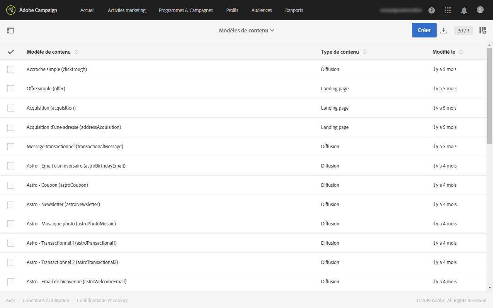
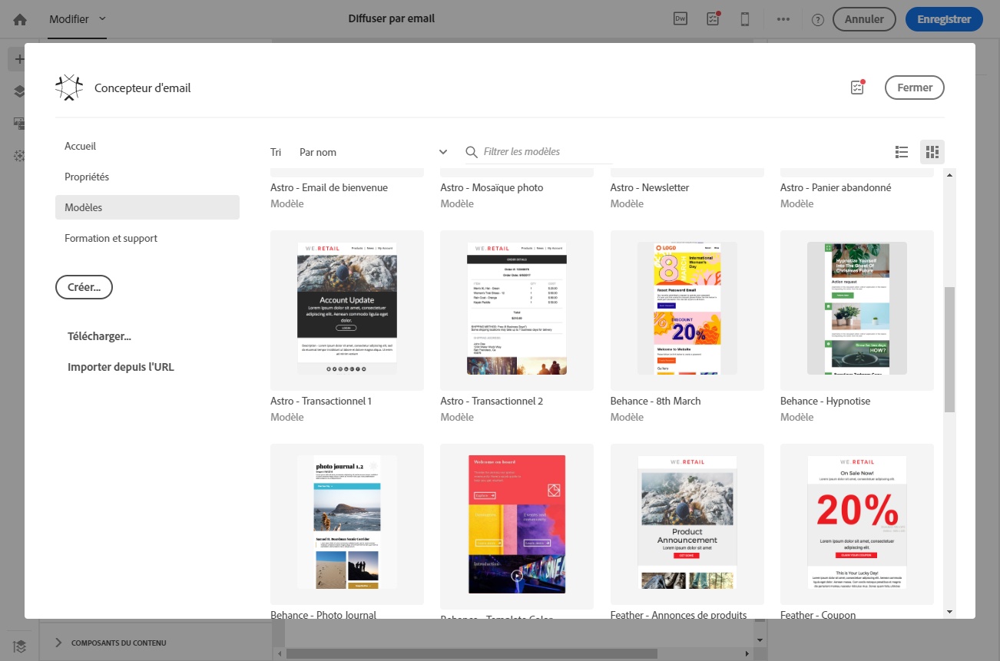
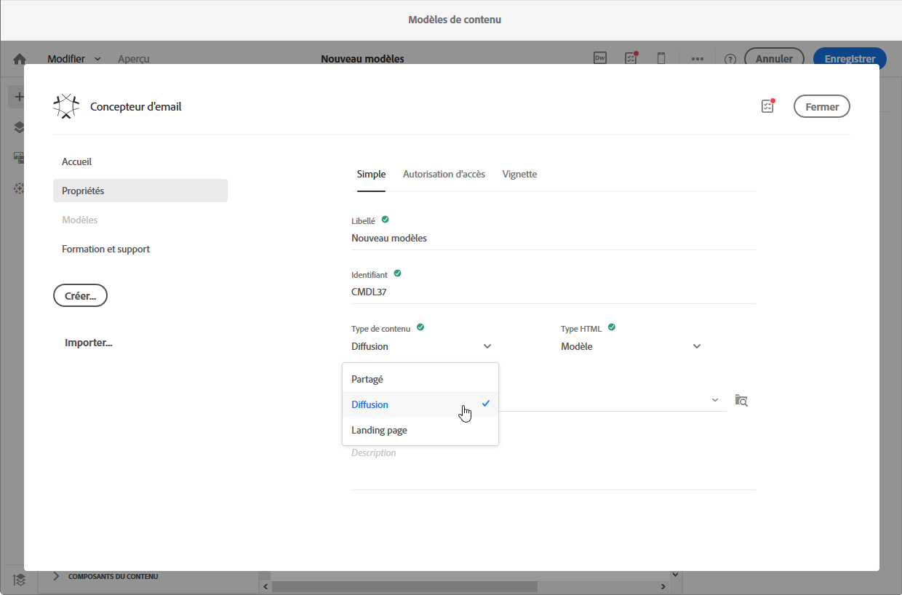
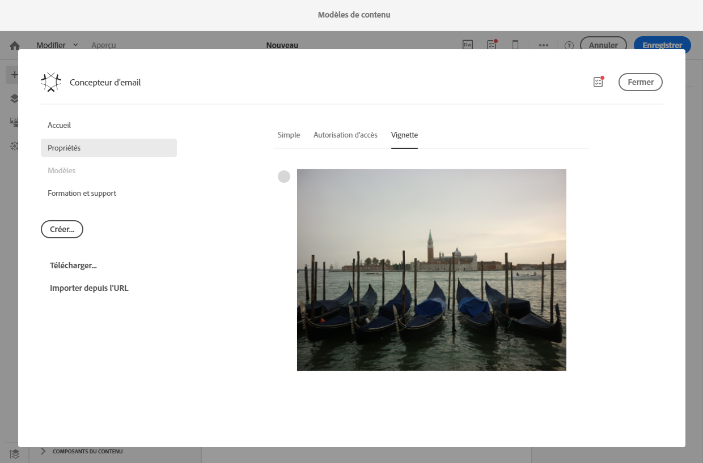
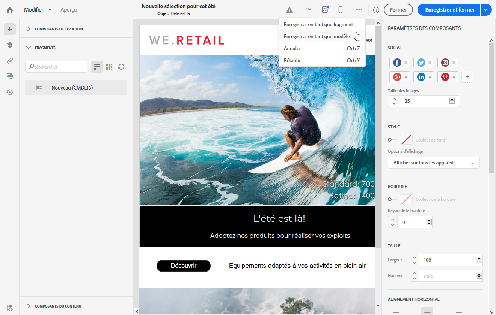
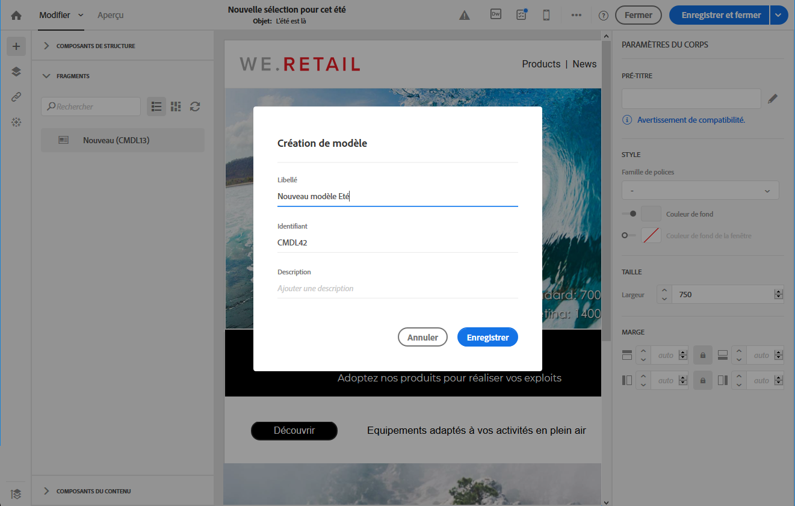

# Modèles{#about-templates}

## Modèles d'activité marketing {#marketing-activity-templates}

Lorsque vous créez une activité marketing, le premier écran de l'assistant vous invite à sélectionner un type – ou modèle. Les modèles vous permettent de préconfigurer certains paramètres selon vos besoins. Le modèle peut contenir un paramétrage complet ou partiel de l'activité marketing. La gestion des modèles est effectuée par l'administrateur fonctionnel.

L'utilisateur final bénéficie d'une interface simplifiée. Lors de la création d'une activité marketing, il lui suffit de sélectionner le modèle souhaité. Il n'a pas à se soucier du paramétrage technique. Celui-ci a en effet été pré-configuré par l'administrateur fonctionnel dans le modèle.

Par exemple, dans le cas d'un modèle d'email, vous pouvez pré-renseigner le contenu HTML, l'audience et tout autre paramètre de votre diffusion : planning, profils de test, propriétés générales de la diffusion, paramètres avancés, etc. Vous gagnez ainsi du temps lors de la création d'une activité.

Pour chaque type d'activité marketing, un ou plusieurs modèles d'usine sont proposés. Ils proposent un paramétrage minimal pour chaque type d'activité marketing. Ces modèles d'usine ne peuvent être ni modifiés, ni supprimés.

Des modèles sont disponibles pour les activités marketing suivantes :

* Programmes
* Opérations
* Diffusions Email
* Diffusions SMS
* Notifications push
* Landing pages
* Workflows
* Services
* Import
* Messages transactionnels

La gestion de ces modèles s'effectue sur l'écran **[!UICONTROL Ressources]** &gt; **[!UICONTROL Modèles]**.

>[!NOTE]
>
>Le paramétrage des marques peut être pré-configuré dans un modèle d'email ou de landing page. Voir à ce sujet la section [Marques](../../administration/using/branding.md).

## Modèles de contenu {#content-templates}

Les modèles de contenu HTML sont accessibles à partir de l'écran **[!UICONTROL Ressources]** &gt; **[!UICONTROL Modèles et fragments de contenu]** du [menu Avancé](../../start/using/interface-description.md#advanced-menu). Depuis cet emplacement, vous pouvez gérer les modèles de contenu de landing page et d'email, ainsi que les fragments.

Les modèles de contenu d'usine sont en lecture seule. Pour éditer l'un des modèles, vous devez d'abord le dupliquer.

Vous pouvez créer des modèles ou des fragments et définir vos propres contenus. Pour plus d'informations, consultez [Création d'un modèle de contenu](#creating-a-content-template) et [Création d'un fragment de contenu](../../designing/using/using-reusable-content.md#creating-a-content-fragment).

Lors de l'édition de contenu à l'aide du Concepteur d'email, vous pouvez également créer des modèles de contenu en enregistrant le contenu en tant que fragment ou modèle. Voir à ce propos [Enregistrer du contenu en tant que modèle](#saving-content-as-template) et [Enregistrer du contenu en tant que fragment](../../designing/using/using-reusable-content.md#saving-content-as-a-fragment).

### Modèles de contenu d'email d'usine {#email-content-templates}

Vous pouvez gérer les contenus HTML qui seront proposés dans l'onglet **[!UICONTROL Modèles]** de la page d'accueil du [Concepteur d'email](../../designing/using/designing-content-in-adobe-campaign.md).

Les modèles de contenu d'email d'usine comprennent 18 mises en page optimisées pour les appareils mobiles et quatre modèles réactifs conçus par des artistes Behance. Ils correspondent aux utilisations les plus courantes : messages de bienvenue, newsletters, emails de réengagement, etc. Ils peuvent être facilement personnalisés avec le contenu de vos marques afin de faciliter la création des emails.

**Rubriques connexes :**

* Découvrez comment personnaliser les modèles de contenu [dans cette vidéo](https://helpx.adobe.com/campaign/kt/acs/using/acs-email_content_templates-feature-video-use.html).
* Pour plus d'informations sur l'édition de contenu, voir [A propos de la conception du contenu d'un email](../../designing/using/designing-content-in-adobe-campaign.md).

### Créer un modèle de contenu {#creating-a-content-template}

Vous pouvez créer vos propres modèles de contenu pour les utiliser autant de fois que nécessaire.

L'exemple ci-dessous montre comment créer un modèle de contenu d'email.

1. Accédez à **[!UICONTROL Ressources]** &gt; **[!UICONTROL Modèles et fragments de contenu]**, puis cliquez sur **[!UICONTROL Créer]**.
1. Cliquez sur le libellé d'email de façon à accéder à l'onglet **[!UICONTROL Propriétés]** du Concepteur d'email.
1. Spécifiez un libellé reconnaissable et sélectionnez les paramètres suivants afin d'utiliser ce modèle dans les emails :

   * Sélectionnez **[!UICONTROL Partagé]** ou **[!UICONTROL Diffusion]** dans la liste déroulante **[!UICONTROL Type de contenu]**.
   * Sélectionnez **[!UICONTROL Modèle]** dans la liste déroulante **[!UICONTROL Type HTML]**.
   

1. Si nécessaire, vous pouvez définir une image qui sera utilisée comme miniature du modèle. Sélectionnez-la dans l'onglet **[!UICONTROL Miniature]** des propriétés de modèle.

   

   Cette miniature sera affichée dans l'onglet **[!UICONTROL Modèles]** de la page d'accueil du [Concepteur d'email](../../designing/using/designing-content-in-adobe-campaign.md).

1. Fermez l'onglet **[!UICONTROL Propriétés]** pour retourner à l'espace de travail principal.
1. Ajoutez des composants de structure et de contenu que vous pouvez personnaliser au besoin.
   >[!NOTE]
   >
   > Vous ne pouvez pas insérer des champs de personnalisation ni du contenu conditionnel dans un modèle de contenu.
1. Une fois le modèle édité, enregistrez-le.

Ce modèle peut à présent être utilisé dans n'importe quel email créé avec le Concepteur d'email. Sélectionnez-le dans l'onglet **[!UICONTROL Modèles]** de la page d'accueil du [Concepteur d'email](../../designing/using/designing-content-in-adobe-campaign.md).

### Enregistrer du contenu en tant que modèle {#saving-content-as-template}

Lorsque vous éditez un email avec le Concepteur d'email, vous ne pouvez pas enregistrer directement le contenu de cet email en tant que modèle.

<!--[!CAUTION]
>
>You cannot save as template a structure containing personalization fields or dynamic content.-->

1. Sélectionnez **[!UICONTROL Enregistrer en tant que modèle]** dans la barre d'outils principale du Concepteur d'email.

   

1. Ajoutez un libellé et une description en cas de besoin, puis cliquez sur **[!UICONTROL Enregistrer]**.

   

1. Pour retrouver le modèle que vous venez de créer, accédez à **[!UICONTROL Ressources]** &gt; **[!UICONTROL Modèles et fragments de contenu]**.

1. Pour utiliser votre nouveau modèle, sélectionnez-le dans l'onglet **[!UICONTROL Modèles]** de la page d'accueil du [Concepteur d'email](../../designing/using/designing-content-in-adobe-campaign.md).

   

