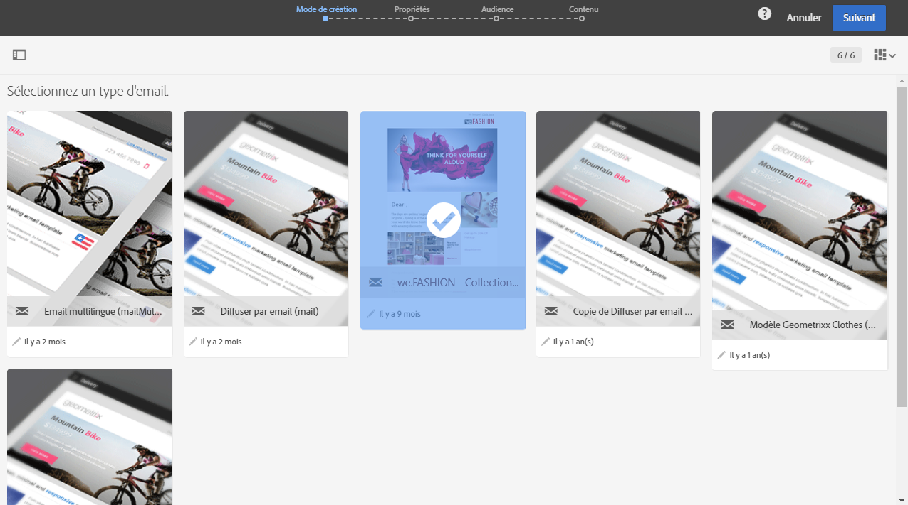

# Modèles{#about-templates}

## Modèles d'activité marketing {#marketing-activity-templates}

Lorsque vous créez une activité marketing, le premier écran de l'assistant vous invite à sélectionner un type – ou modèle. Les modèles vous permettent de préconfigurer certains paramètres selon vos besoins. Le modèle peut contenir un paramétrage complet ou partiel de l'activité marketing. La gestion des modèles est effectuée par l’administrateur fonctionnel.

L'utilisateur final bénéficie d'une interface simplifiée. Lors de la création d'une activité marketing, il lui suffit de sélectionner le modèle souhaité. Il n'a pas à se soucier du paramétrage technique. Celui-ci a en effet été pré-configuré par l'administrateur fonctionnel dans le modèle.

Par exemple, dans le cas d'un modèle d'email, vous pouvez pré-renseigner le contenu HTML, l'audience et tout autre paramètre de votre diffusion : planning, profils de test, propriétés générales de la diffusion, paramètres avancés, etc. Vous gagnez ainsi du temps lors de la création d'une activité.

Pour chaque type d'activité marketing, un ou plusieurs modèles d'usine sont proposés. Ils proposent un paramétrage minimal pour chaque type d'activité marketing. Ces modèles d'usine ne peuvent être ni modifiés, ni supprimés.

Des modèles sont disponibles pour les activités marketing suivantes :

* Programmes
* Campagnes
* Diffusions Email
* Diffusions SMS
* Notifications push
* Landing pages
* Workflows
* Services
* Import
* Messages transactionnels

These templates are managed from the **[!UICONTROL Resources]** &gt; **[!UICONTROL Templates]** screen.

>[!NOTE]
>
>Le paramétrage des marques peut être pré-configuré dans un modèle d'email ou de landing page. Voir à ce sujet la section [Marques](../../administration/using/branding.md).

## Modèles de contenu {#content-templates}

Vous pouvez gérer les contenus HTML qui seront proposés dans l'onglet **[!UICONTROL Modèles]** de la page d'accueil du [Concepteur d'email](../../designing/using/about-email-content-design.md#about-the-email-designer).

Ces modèles comprennent 18 mises en page optimisées pour les appareils mobiles et quatre modèles réactifs conçus par des artistes Behance. Ils correspondent aux utilisations les plus courantes : messages de bienvenue, newsletters, emails de réengagement, etc. Ils peuvent être facilement personnalisés avec le contenu de vos marques afin de faciliter la création des emails.

These out-of-the-box HTML contents are accessible from the **[!UICONTROL Template]** &gt; **[!UICONTROL Content templates &amp; fragments]** screen of the [Advanced menu](../../start/using/interface-description.md#advanced-menu). Ils sont en lecture seule. Pour éditer l'un de ces contenus, vous devez d'abord le dupliquer. Vous pouvez également créer des modèles et définir vos propres contenus.

**Rubriques connexes :**

* Découvrez comment personnaliser les modèles de contenu [dans cette vidéo](https://helpx.adobe.com/campaign/kt/acs/using/acs-email_content_templates-feature-video-use.html).
* Pour plus d'informations sur l'édition de contenu, voir [A propos de la conception du contenu d'un email](../../designing/using/about-email-content-design.md).

