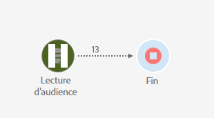

# Accessibilité en Adobe Campaign Standard {#accessibility-acs}

Découvrez la prise en charge de l’accessibilité dans Adobe Campaign Standard Workspace.

L&#39;accessibilité se rapporte à rendre des produits utilisables par les personnes ayant des déficiences visuelles, auditives, cognitives, motrices et autres. Parmi les exemples de fonctionnalités d’accessibilité pour les logiciels, citons la prise en charge des lecteurs d’écran, les équivalents de texte pour les graphiques, les raccourcis clavier, le changement des couleurs d’affichage en contraste élevé, etc.

Adobe Campaign Standard fournit quelques outils qui le rendent accessible pour l’utilisation, tels que le contraste, la navigation au clavier, l’aide contextuelle et la redimensionnement adaptée.

## Fonctionnalités d&#39;accessibilité {#accessibility-features}

### Contraste {#contrast}

L’interface utilisateur Adobe Campaign Standard s’efforce de fournir un contraste suffisant dans l’application afin de garantir une expérience d’affichage accessible aux utilisateurs présentant une faible vision ou des déficiences en couleur.

* Les icônes d’interruption et d’annulation des workflows ont été mises à jour afin d’améliorer le contraste entre l’arrière-plan et le premier plan.

   

* Le texte affiché en cas de réussite d’une diffusion contenait un texte vert volumineux avec un contraste insuffisant entre l’arrière-plan et le premier plan. Le contraste a été mis à jour avec un rapport minimum de 3:1.

   

* Adobe Campaign Standard s&#39;assure que la couleur, la forme ou l&#39;emplacement ne sont pas les seules méthodes utilisées pour communiquer des informations ou la hiérarchie.

### Interface utilisateur {#user-interface}

L’interface utilisateur Adobe Campaign Standard facilite l’affichage et l’écoute du contenu, notamment la séparation du premier plan de l’arrière-plan et l’ajout de textes alternatifs aux différents boutons disponibles.

* Lorsque l’utilisateur laisse vide un champ d’ID obligatoire, un graphique indique visuellement quel champ est en erreur avec un texte de message d’erreur.

   

* Le contenu qui s’affiche au survol ou au focus peut être ignoré par l’utilisateur et n’obscurcit aucun autre contenu.

   

* Des textes alternatifs pour les boutons d’image ont été ajoutés et peuvent être lus au lieu d’afficher une illustration.

   

* Lors de l’utilisation de listes, les cellules d’en-têtes de tableau de données ne sont pas vides dans l’angle du tableau.

### Créer un redimensionnement réactif pour plusieurs périphériques {#resize-devices}

Lors de la conception pour plusieurs périphériques et plates-formes, il est important de créer une expérience transparente pour les tailles d’écran dans les résolutions des périphériques mobiles et des ordinateurs de bureau.

Adobe Campaign Standard vous permet de concevoir et de tester des courriers électroniques et des notifications Push sur différents périphériques, tels que : iPhone, appareils Android, iPad, tablette et bureau Android.

## Aide contextuelle {#contextual-help}

>[!NOTE]
>
> L’aide contextuelle n’est disponible que lors de l’utilisation du concepteur de courrier électronique.

L’aide contextuelle peut vous aider à mieux comprendre les différents champs et fonctionnalités demandés disponibles. Il vous guide également à travers la documentation du produit pour en savoir plus sur la fonction sélectionnée.

Lors de la conception d’un courrier électronique, vous pouvez placer le curseur sur le bouton d’informations. Une info-bulle s’affiche, fournissant des descriptions de fonctions et des liens vers la documentation du produit.

## Prise en charge des agrandisseurs d’écran {#screen-magnifiers}

Un lecteur d’écran lit le texte qui s’affiche sur l’écran de l’ordinateur. Il lit également les informations non textuelles, telles que les étiquettes de bouton ou les descriptions d’image dans l’application, fournies dans les balises ou attributs d’accessibilité.

En Adobe Campaign Standard, le contenu et les fonctionnalités sont toujours disponibles même si l’utilisateur remplace les propriétés d’espacement du texte.

## Travailler dans la langue que vous préférez {#languages}

L&#39;Adobe Campaign Standard est disponible dans différentes langues : anglais, français et allemand.

Veuillez noter que la langue est configurée à l&#39;installation et ne peut pas être modifiée par la suite.

## Raccourcis clavier {#shortcuts}

### Page d&#39;accueil {#homepage-shortcuts}

| Raccourci | Action |
|:-:|:-:|
| Onglet | Parcourir les différents éléments de l’interface utilisateur |
| Entrer ou espacer | Activer l&#39;élément sélectionné |

### Concepteur d&#39;email {#email-designer-shortcuts}

| Raccourci | Action |
|:-:|:-:|
| Ctrl + Z | Annuler |
| Ctrl + Y | Rétablir |

### Rapports dynamiques {#report-shortcuts}

| Raccourci | Action |
|:-:|:-:|
| Ctrl + O | Ouvrir le projet |
| Ctrl + S | Enregistrer |
| Maj + Ctrl + S | Enregistrer sous |
| Alt + R | Actualiser le projet |
| Maj + Ctrl + V | Télécharger le fichier CSV |
| Alt + P | Imprimer |
| Ctrl + Z | Annuler |
| Ctrl + Maj + Z | Rétablir |
| Alt + B | Nouveau panneau vierge |
| Alt + A | Nouvelle forme libre |
| Alt + 1 | Nouveau tableau à structure libre |
| Alt + 2 | Nouvelle ligne |
| Alt + 3 | Nouvelle barre |
| Alt + S | Envoyer le rapport maintenant |
| Maj + Alt + S | Envoyer le rapport selon le calendrier |
| Maj = Alt + L | Rapports planifiés |

## Autres lectures {#further-reading}

Adobe Campaign Standard s&#39;efforce de fournir un niveau d&#39;accessibilité toujours plus élevé, ce qui rend le produit facile à utiliser pour tous.

Nous vous encourageons à utiliser le [formulaire de commentaires sur l&#39;accessibilité des Adobes](https://www.adobe.com/accessibility/feedback.html) pour nous envoyer des suggestions d&#39;amélioration et des questions d&#39;accessibilité que vous rencontrez.

Vous pouvez également consulter les [notes de mise à jour de Adobe Campaign Standard](https://experienceleague.adobe.com/docs/campaign-standard/using/release-notes/release-notes.html?lang=en#release-notes) pour suivre les dernières améliorations et fonctionnalités.