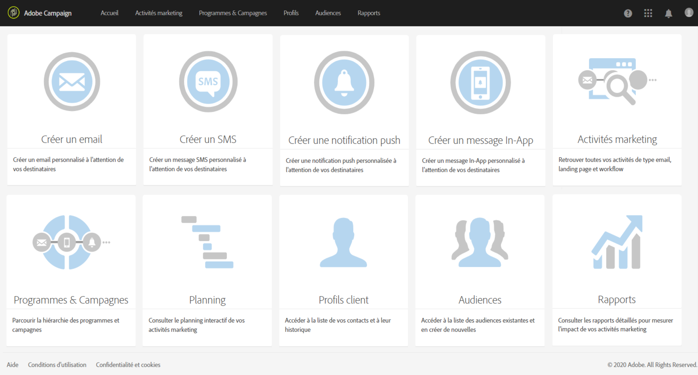

# Orchestration des campagnes{#campaign-orchestration}

Adobe Campaign est un puissant outil de gestion de campagnes cross-canal. Il peut vous aider à aligner vos stratégies en ligne et hors ligne de façon à créer des expériences client personnalisées. Adobe Campaign propose une plate-forme de gestion des campagnes qui permet de piloter la création, l&#39;exécution et le tracking des campagnes sur différents canaux, et l&#39;envoi de messages personnalisés selon le profil, le comportement, les préférences et les besoins des clients. Vous pouvez orchestrer, modéliser et automatiser facilement l&#39;ensemble du processus marketing et intégrer Adobe Campaign à d&#39;autres solutions Adobe.

Les principales fonctionnalités d&#39;Adobe Campaign sont les suivantes :

* la création et le développement d&#39;une base de données marketing : gestion des profils, mécanismes d&#39;import/export, éditeur de requêtes ;
* la segmentation des données, la gestion des données et le ciblage pour envoyer le bon message à la bonne audience ;
* l&#39;orchestration, la gestion et l&#39;exécution des campagnes sur différents canaux via un plan marketing et diverses activités marketing : landing pages, workflows, messages off-line et on-line, messages transactionnels, etc. ;
* la conception et la diffusion des messages sur les canaux de communication en ligne et hors ligne, y compris l&#39;optimisation de la diffusion d&#39;emails pour plusieurs appareils via des stratégies de test et de responsive design, des SMS, des notifications push et des messages In-App ;
* la génération de rapports opérationnels pour tracker l&#39;impact de vos campagnes et piloter votre solution, ainsi que des fonctionnalités de reporting dynamique pour créer vos propres rapports.

Les principales phases de création et d&#39;orchestration d&#39;une campagne marketing avec Adobe Campaign sont les suivantes :

* **Préparation** - Cette phase préliminaire permet de formaliser le besoin, le propos et l&#39;objectif de la campagne. Elle comprend ainsi la création du plan marketing, l&#39;identification de la cible, la définition du contenu et de son mode de création, les résultats attendus et les personnes impliquées.
* **Ciblage** - La phase de ciblage permet de définir le mode de collecte des données, leur structure, leur segmentation, les audiences, témoins et test, les conditions de filtrage à mettre en œuvre, etc. Lors de cette phase, vous pouvez également configurer les méthodes d&#39;abonnement/de désabonnement. Voir [Profils et audiences](../../audiences/using/about-profiles.md).
* **Création de messages et de contenu** - Cette phase implique la sélection du [canal de communication](../../channels/using/discovering-communication-channels.md). Vous pouvez également concevoir des [landing pages](../../channels/using/getting-started-with-landing-pages.md) afin d&#39;acquérir ou de mettre à jour des profils, et de développer votre base de données. Voir [Créer un email](../../channels/using/creating-an-email.md), [Créer un SMS](../../channels/using/creating-an-sms-message.md), [Créer une notification push](../../channels/using/preparing-and-sending-a-push-notification.md), [Créer un message In-App](../../channels/using/about-in-app-messaging.md) et [Créer une diffusion courrier](../../channels/using/creating-the-direct-mail.md).
* **Test et envoi** - La phase d&#39;exécution permet de réaliser les phases de validation (du contenu, de la cible) notamment à travers les écrans de prévisualisation et l&#39;envoi de BAT aux validants, puis d&#39;envoi. Voir [Tester et envoyer](../../sending/using/about-sending-messages-with-campaign.md).
* **Contrôle et reporting** - Une fois la campagne exécutée et les différents messages envoyés, cette étape permet de collecter les statuts des différents envois, ainsi que les informations de tracking et de contrôle. Les rapports de campagnes et de diffusions sont générés afin de tracker l&#39;impact de la campagne et les activités des destinataires. Voir [Outils de reporting](../../reporting/using/about-dynamic-reports.md).
* **Automatisation** - Pendant cette phase, sont définis d&#39;autres facteurs tels que les méthodes de mise en œuvre des mécanismes d&#39;import/export, la gestion des données et les modes de mise à jour, l&#39;identification des données de personnalisation, etc. Voir [Workflows et gestion des données](../../automating/using/workflow-data-and-processes.md).

