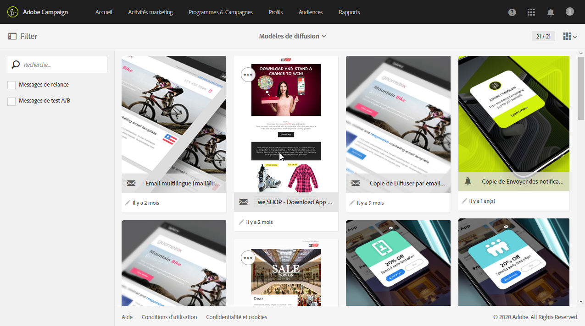
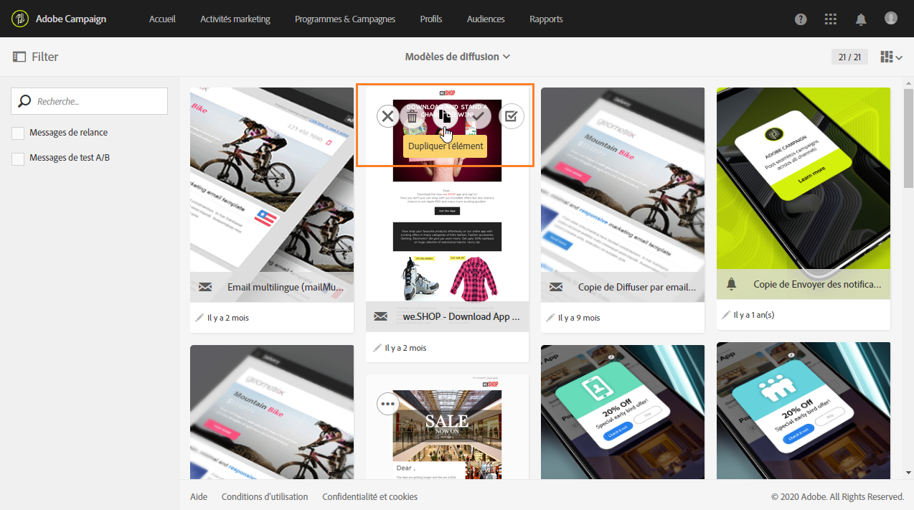
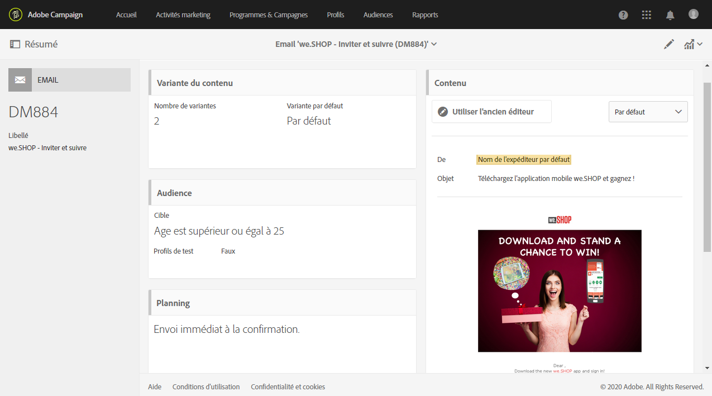

# Créer un modèle{#creating-a-new-template}

Les modèles de message peuvent être gérés par l'administrateur fonctionnel de la plate-forme, depuis le menu **[!UICONTROL Ressources &gt; Modèles.]** Les modèles d'usine ne peuvent être ni modifiés, ni supprimés. Pour créer un modèle, vous devez en dupliquer un existant.

1. Sélectionnez un modèle existant. Dans notre exemple, nous avons choisi un **[!UICONTROL Modèle de diffusion]**.

   

1. Survolez-le avec la souris, puis sélectionnez l'option **[!UICONTROL Dupliquer l'élément].**

   

1. Configurez les paramètres de votre choix comme vous le feriez lors de la [création d'une activité marketing](../../start/using/marketing-activities.md#creating-a-marketing-activity).

   

Les modèles créés peuvent être ensuite sélectionnés par un utilisateur standard dans le premier écran de l'assistant lors de la création d'une activité marketing.

**Rubriques connexes :**

* [Marques](../../administration/using/branding.md)
* [Conception du contenu](../../designing/using/about-email-content-design.md)

