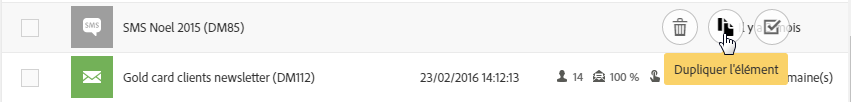
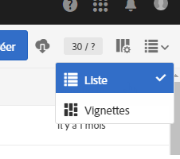
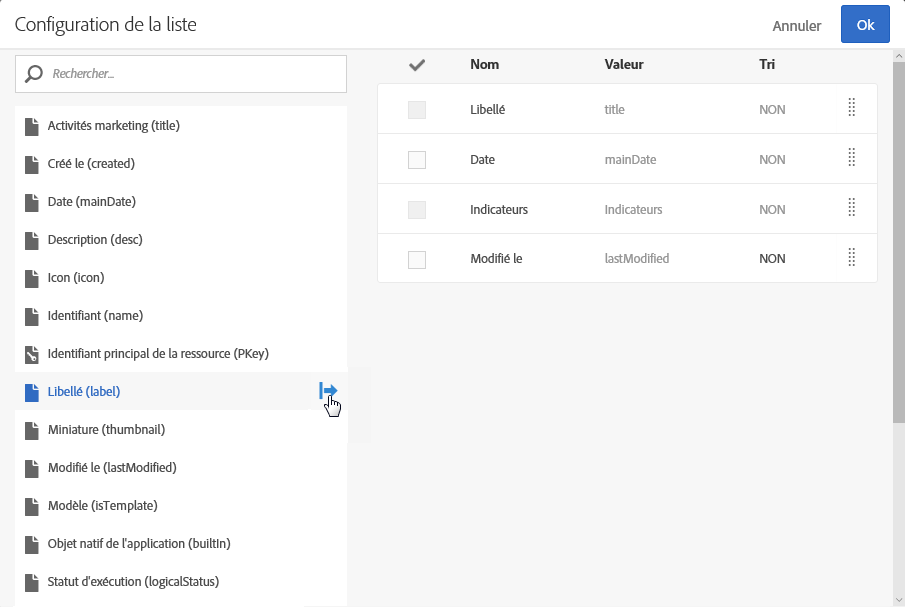

# Personnalisation des listes{#customizing-lists}

Les écrans de type **Liste** permettent d'afficher les éléments d'une ou de plusieurs ressources données.

Adobe Campaign propose deux types de listes :

* Une liste **homogène** qui contient un seul type de ressource. Par exemple, la liste des profils contient uniquement des profils.
* Une liste **hétérogène** qui contient plusieurs types de ressources. Par exemple : la liste des activités marketing contient des landing pages, des workflows, des emails, des SMS, etc.

Les listes sont affichées en colonnes. Chaque colonne peut être triée dans un ordre croissant ou décroissant, une à la fois.

Les éléments d'une liste disposent d'une case à cocher permettant de les sélectionner. En sélectionnant un ou plusieurs éléments, vous pouvez effectuer plusieurs actions, notamment éditer, dupliquer et supprimer ces éléments.

Au survol d'un élément de liste, des **actions contextuelles** apparaissent. Ces actions permettent différentes interactions avec l'élément survolé comme l'édition, la sélection, la suppression ou l'affichage des détails.

Vous pouvez également configurer les colonnes affichées pour une liste. Pour ajouter ou retirer des colonnes :

1. Le cas échéant, assurez-vous que l'écran se trouve bien en mode **Liste**.

   

1. Accédez à la fenêtre de configuration de la liste à l'aide du bouton 

   

1. Ajoutez les colonnes que vous souhaitez inclure dans votre liste. Pour cela, sélectionnez une colonne depuis la partie gauche de la fenêtre puis utilisez le bouton 

   Les colonnes sélectionnables correspondent à la ressource de la liste.

   Pour chaque colonne ajoutée, indiquez si vous souhaitez appliquer un tri par défaut :

   * **[!UICONTROL NON : aucun tri sur la colonne]**
   * **[!UICONTROL ASC : applique un tri ascendant (croissant) sur la colonne]**
   * **[!UICONTROL DESC]** : applique un tri descendant (décroissant) sur la colonne.

1. Supprimez les colonnes que vous ne souhaitez pas afficher. Pour cela, cochez les cases correspondant aux colonnes à supprimer. Utilisez ensuite le bouton 
1. Une fois que votre liste contient les bonnes colonnes, vous pouvez modifier l'ordre dans lequel elles seront affichées dans la liste. Pour cela, cochez les cases des colonnes à déplacer. Utilisez ensuite les flèches  et 
1. Validez la configuration de votre liste en sélectionnant **[!UICONTROL OK]**.

Votre liste est désormais affichée telle que vous l'avez configurée.
