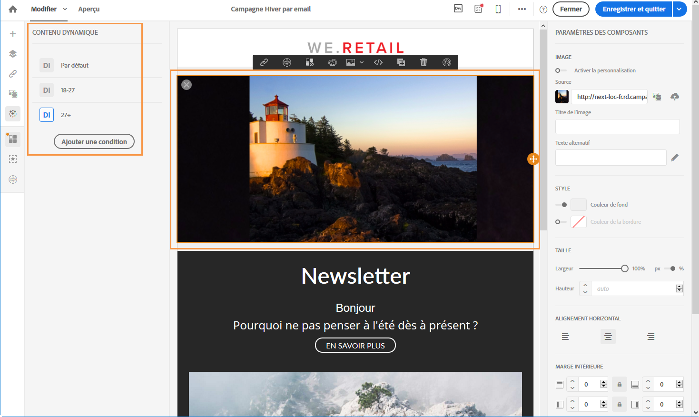

# Contenu dynamique et personnalisé{#dynamic-and-personalized-content}

Retenez l'attention de vos clients et améliorez vos taux de réponses grâce à une personnalisation évoluée du contenu et des en-têtes des messages selon leur profil, leurs préférences et leur activité. Toutes les informations concernant vos clients sont centralisées dans Adobe Campaign et vous pouvez leur proposer des messages au contenu adapté, sur les différents canaux.

Les messages personnalisés sont essentiels pour envoyer du contenu pertinent, proposer des expériences personnalisées et augmenter les taux d'ouverture et de conversion. Les messages cross-canal diffusés par Adobe Campaign peuvent être personnalisés de différentes façons. Ces différentes façons peuvent être associées à des critères en fonction des profils. Vous pouvez ainsi :

* insérer des [champs de personnalisation dynamiques](../../designing/using/inserting-a-personalization-field.md) dans vos messages ;
* insérer des [blocs de personnalisation prédéfinis](../../designing/using/adding-a-content-block.md) ;
* [personnaliser l'expéditeur](../../designing/using/personalizing-the-sender.md) d'un email ou d'un SMS ;
* [personnaliser l'objet](../../designing/using/personalizing-the-subject-line-of-an-email.md) d'un email ou utiliser les fonctionnalités d'[optimisation prédictive de l'objet](../../designing/using/personalizing-the-subject-line-of-an-email.md#predictive-subject-line) pour ce faire ;
* créer du [contenu conditionnel dans un email](../../designing/using/defining-dynamic-content-in-an-email.md) ou [sur une landing page](../../designing/using/defining-dynamic-content-in-a-landing-page.md) ;
* insérer du [texte dynamique](../../designing/using/defining-dynamic-text.md) dans un SMS ou une notification push.

**Rubriques connexes :**

* Découvrez la personnalisation des emails à travers un [exemple de bout en bout](../../designing/using/example--email-personalization.md)
* Découvrez comment personnaliser des URL [sur cette page](../../designing/using/personalizing-urls.md)
* Découvrez comment configurer la personnalisation d'une image [sur cette page](../../designing/using/personalizing-an-image-source.md)

