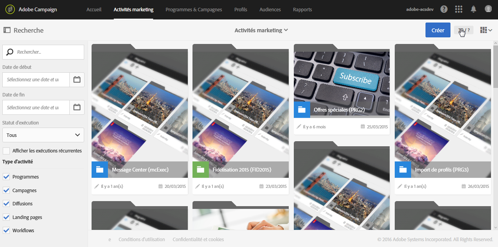
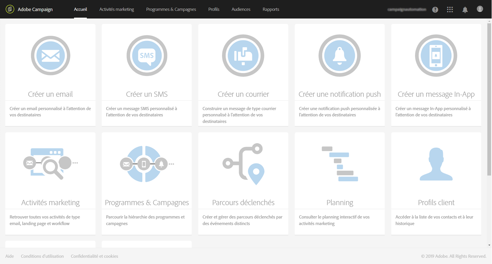
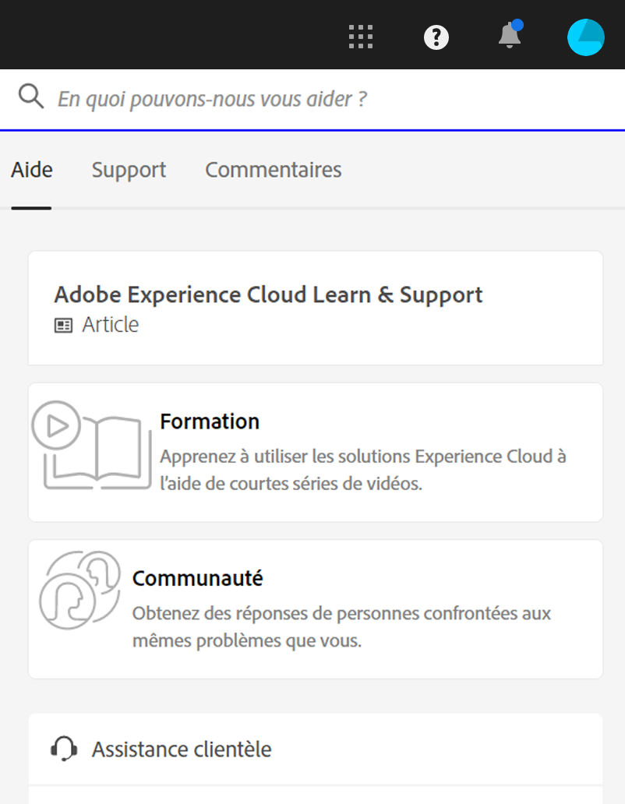
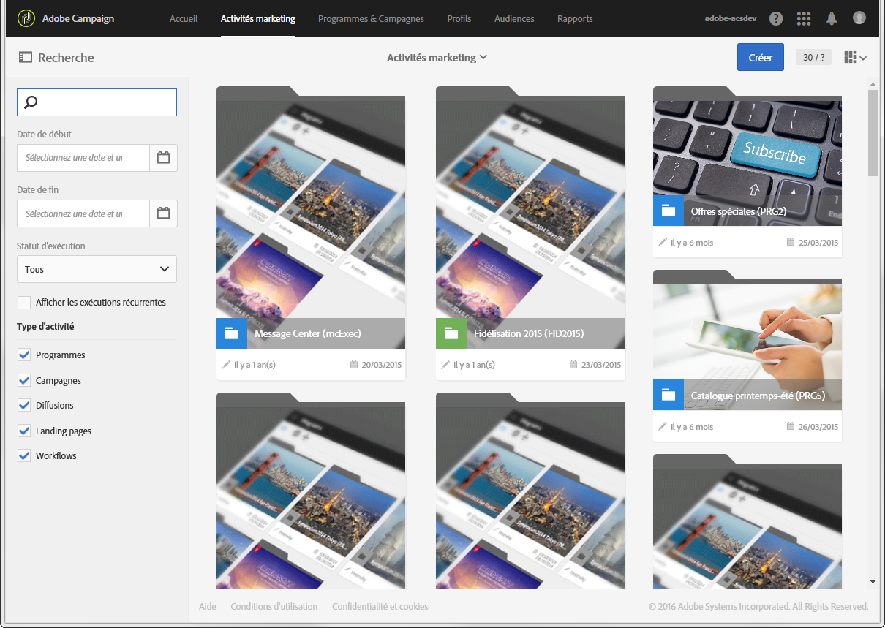
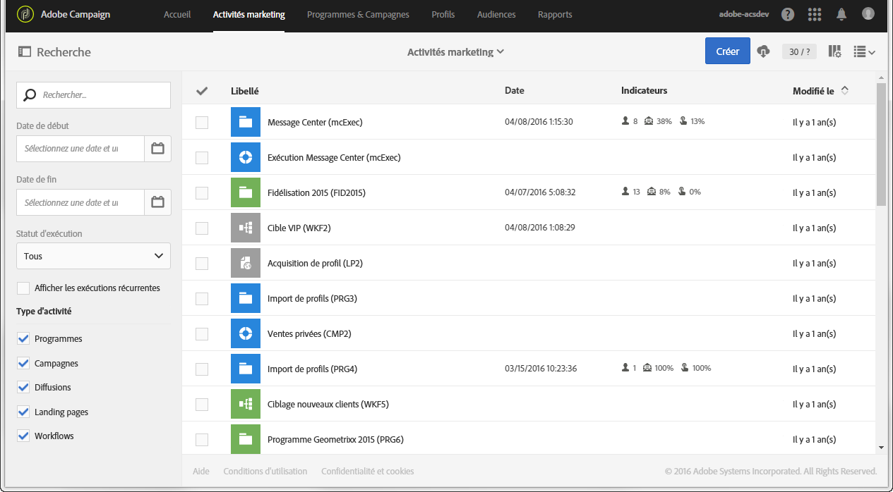
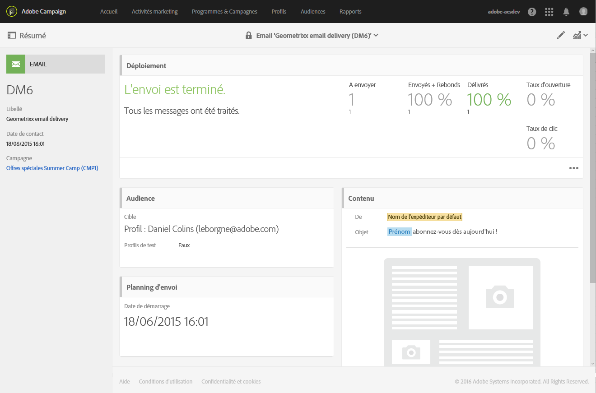
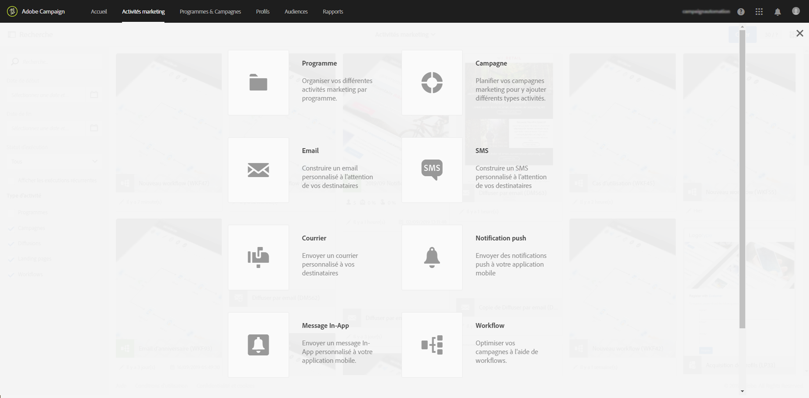
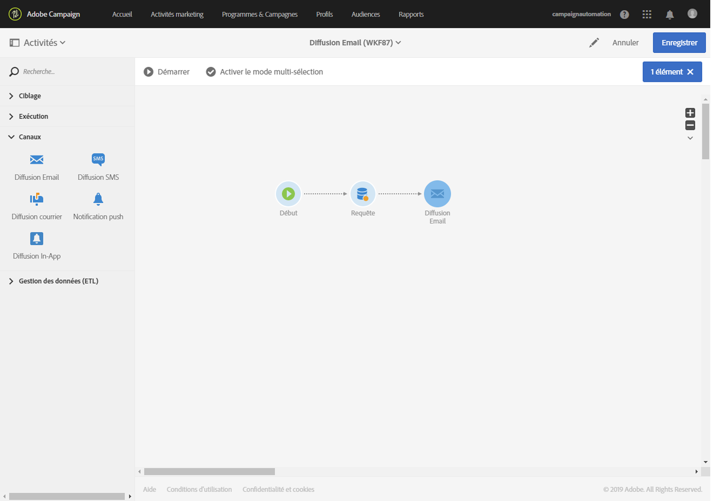
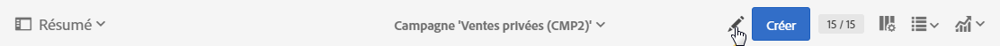

# Description de l&#39;interface{#interface-description}

Adobe Campaign vous permet de naviguer à travers différents menus et écrans pour gérer vos campagnes.

Tous les écrans d&#39;Adobe Campaign se composent des éléments suivants :

* Une barre supérieure pour la navigation
* Un menu avancé pour l&#39;accès aux fonctionnalités et paramétrages spécifiques
* Une zone centrale pour travailler sur certains éléments
* Selon le contexte, un panneau latéral peut être affiché pour filtrer ou rechercher parmi les éléments affichés.

## Page d&#39;accueil   {#home-page}

La page d&#39;accueil se compose d&#39;un jeu de vignettes qui permet un accès rapide aux principales fonctionnalités d&#39;Adobe Campaign. La liste des capacités figurant dans la page d&#39;accueil de Campaign dépend de vos permissions et des options configurées pour votre organisation.

* La vignette **[!UICONTROL Créer un email]** permet d&#39;accéder à l&#39;assistant de création d&#39;email. Grâce à cet assistant, vous pouvez choisir un type d&#39;email, sélectionner les destinataires de votre message et définir votre contenu. Voir à ce propos la section [Créer un email](../../channels/using/creating-an-email.md).
* La vignette **[!UICONTROL Créer un SMS]** permet d&#39;accéder à l&#39;assistant de création de SMS. Grâce à cet assistant, vous pouvez choisir un type de SMS, sélectionner les destinataires de votre message et définir votre contenu. Voir à ce propos la section [Créer un SMS](../../channels/using/creating-an-sms-message.md).
* La vignette **[!UICONTROL Créer un courrier]** permet d&#39;accéder à l&#39;assistant de création de courrier. Voir à ce propos la section [Créer un courrier](../../channels/using/creating-the-direct-mail.md).
* La vignette **[!UICONTROL Créer une notification push]** permet d&#39;accéder à l&#39;assistant de création de notification. Grâce à cet assistant, vous pouvez choisir un type de notification push, sélectionner les destinataires de votre message et définir votre contenu. Voir la section [Créer une notification push](../../channels/using/preparing-and-sending-a-push-notification.md).
* La vignette **[!UICONTROL Créer un message In-App]** permet d&#39;accéder à l&#39;assistant de création In-App. Cet assistant vous permet de sélectionner le type de message In-App que vous voulez créer, ainsi que de définir ses propriétés, son audience et son contenu. Voir à ce propos la section [Créer un message In-App](../../channels/using/about-in-app-messaging.md).
* La vignette **[!UICONTROL Activités marketing]** permet d&#39;accéder à la liste de toutes les activités, tous les programmes et toutes les campagnes, notamment emails, SMS, workflows et landing pages. Vous pouvez ensuite filtrer les objets en effectuant des recherches par nom, date, statut ou type d&#39;activité. Voir à ce propos la section [Liste des activités marketing](../../start/using/marketing-activities.md#about-marketing-activities).
* La vignette **[!UICONTROL Programmes &amp; Campagnes]** permet d&#39;accéder à la liste des programmes dans lesquels vous pouvez créer et gérer vos campagnes. Voir à ce propos la section [Liste des programmes](../../start/using/programs-and-campaigns.md#about-plans--programs-and-campaigns).
* La vignette **[!UICONTROL Planning]** permet d&#39;accéder au planning de vos activités marketing, dans lequel vous pouvez consulter les programmes en cours et leur contenu. Voir à ce propos la section [Planning](../../start/using/timeline.md).
* La vignette **[!UICONTROL Profils client]** permet d&#39;accéder directement à la liste des profils et de consulter les événements concernant chacun d&#39;entre eux. Voir à ce propos la section [Gestion des profils](../../audiences/using/about-profiles.md).
* La vignette **[!UICONTROL Audiences]** permet d&#39;accéder directement à la liste des audiences. A partir de là, vous pouvez accéder aux audiences existantes et en créer de nouvelles. Voir à ce propos la section [Gestion des audiences](../../audiences/using/about-audiences.md).

## Barre supérieure   {#top-bar}

Visible sur chaque écran, la barre supérieure vous permet de naviguer entre les fonctionnalités d&#39;Adobe Campaign et d&#39;accéder au profil Adobe connecté, aux notifications, aux autres services et solutions Adobe Experience Cloud ainsi qu&#39;à la documentation.

Les principes de navigation sont les suivants :

* Le logo **[!UICONTROL Adobe Campaign]**, situé dans le coin supérieur gauche de la page, vous donne accès aux configurations et fonctionnalités avancées. Les menus dépendent de votre profil et de vos permissions.

   Le menu avancé est présenté dans la section [Menu avancé](#advanced-menu).

* Le lien **[!UICONTROL Accueil]** permet d&#39;afficher la page d&#39;accueil d&#39;Adobe Campaign.
* Les liens **[!UICONTROL Activités marketing]**, **[!UICONTROL Programmes et Campagnes]**, **[!UICONTROL Profils]**, **[!UICONTROL Audiences]** et **[!UICONTROL Rapports]** permettent d&#39;accéder aux vues liées à ces fonctionnalités.
* Le bouton **[!UICONTROL Aide]** donne accès à la documentation produit et à l&#39;aide contextuelle, aux notes de mise à jour, aux numéros de versions, aux mentions légales, ainsi qu&#39;à des liens vers la communauté Adobe Experience Cloud et l&#39;assistance client.

   

* L&#39;icône **Sélectionner une solution** vous permet de passer à une autre solution Adobe Experience Cloud de même qu&#39;aux paramètres de profil.
* L&#39;icône **Notifications** affiche les dernières alertes ou informations.
* L&#39;icône **Utilisateur** vous permet d&#39;afficher des informations liées à votre profil. Elle donne accès au bouton **[!UICONTROL Déconnexion]**.

## Le menu avancé {#advanced-menu}

Le menu avancé s&#39;affiche lorsque vous cliquez sur l&#39;icône **Adobe Campaign**, en haut à gauche de chacun des écrans. Il peut varier en fonction de votre contrat et des permissions utilisateur.

Ce menu permet de naviguer vers des fonctionnalités et paramétrages spécifiques.

### Plans marketing {#marketing-plans}

L&#39;icône **[!UICONTROL Plans Marketing]** permet d&#39;accéder aux fonctionnalités suivantes :

* **[!UICONTROL Activités marketing]** - voir à ce propos la section [Liste des activités marketing](../../start/using/marketing-activities.md#about-marketing-activities).
* **[!UICONTROL Programmes et Campagnes]** - voir à ce propos la section [Liste des programmes](../../start/using/programs-and-campaigns.md#about-plans--programs-and-campaigns).
* **[!UICONTROL Planning]** - voir à ce propos la section [Planning](../../start/using/timeline.md).
* **[!UICONTROL Messages transactionnels]**, qui contient les sous-menus **[!UICONTROL Diffusions]** et **[!UICONTROL Configuration des événements]** - voir à ce propos la section [Messages transactionnels](../../channels/using/about-transactional-messaging.md).

### Profils &amp; audiences {#profiles-e-audiences}

L&#39;icône **[!UICONTROL Profils &amp; audiences]** permet d&#39;accéder aux fonctionnalités suivantes :

* **[!UICONTROL Profils]** - voir à ce propos la section [Gestion des profils](../../audiences/using/about-profiles.md).
* **[!UICONTROL Profils de test]** - voir à ce propos la section [Gestion des profils de test](../../audiences/using/managing-test-profiles.md).
* **[!UICONTROL Audiences]** - voir à ce propos la section [Gestion des audiences](../../audiences/using/about-audiences.md).
* **[!UICONTROL Services]** - voir à ce propos la section [Créer un service](../../audiences/using/creating-a-service.md).

### Ressources {#resources}

L&#39;icône **[!UICONTROL Ressources]** permet d&#39;accéder aux fonctionnalités suivantes :

* **[!UICONTROL Modèles]**, qui contient les sous-menus pour chaque type de modèle - voir à ce propos la section [Gestion des modèles](../../start/using/marketing-activity-templates.md).
* **[!UICONTROL Blocs de contenu]** - voir à ce propos la section [Ajouter un bloc de contenu](../../designing/using/personalization.md#adding-a-content-block).
* **[!UICONTROL Modèles et fragments de contenu]** - voir à ce propos la section [Modèle de contenu](../../designing/using/using-reusable-content.md#content-templates).

### Administration {#administration}

L&#39;icône **[!UICONTROL Administration]** permet d&#39;accéder aux fonctionnalités avancées qui ne peuvent être utilisées que par un administrateur fonctionnel. Voir à ce propos la section [Administration](../../administration/using/about-administrating-adobe-campaign.md).

## Zone centrale   {#central-zone}

La zone centrale de l&#39;interface utilisateur est une zone dynamique qui contient, par exemple, une liste d&#39;éléments ou un jeu de vignettes. Elle permet d&#39;éditer des éléments existants et de créer des ressources.

Le contenu et le format d&#39;affichage de la zone centrale peuvent varier :

* Une **liste** présentant des éléments : programmes, campagnes, profils, etc. Ces éléments sont visualisables en mode **[!UICONTROL Vignettes]** ou en mode **[!UICONTROL Liste]**. Utilisez le bouton de changement de mode pour passer de l&#39;un à l&#39;autre. Chaque élément présente des indicateurs.

   

   Un compteur permet de connaitre le nombre d&#39;éléments. Si ce nombre dépasse 30 alors le comptage total n&#39;est obtenu qu&#39;en cliquant sur ce compteur.

* Un **tableau de bord** présentant une vue d&#39;ensemble de tous les paramétrages liés à une activité. Cet écran comprend des zones interactives permettant de séparer et de configurer les différents concepts indépendamment.

   

* Lors de la création d&#39;un élément, lorsque plusieurs choix sont possibles, un **écran de sélection** permet de choisir le type d&#39;élément à ajouter (campagnes, diffusions). Cet écran de sélection est également proposé pour l&#39;accès aux rapports.

   

* Pour les workflows et l&#39;éditeur de requêtes, un **espace de travail** avec une palette permet de concevoir l&#39;objet.

   Vous pouvez glisser/déposer les éléments de la palette vers l&#39;espace de travail pour paramétrer l&#39;élément courant.

   

## Barre d&#39;actions {#action-bar}

Selon le type d&#39;écran affiché, une barre contenant des actions liées à l&#39;écran, s&#39;affiche en position haute.

Cette barre contient des actions communes : recherche, filtrage, mais aussi des actions propres à l&#39;écran affiché :

* Pour les actions liées aux écrans de type **espace de travail**, consultez la section [Barre d&#39;actions](../../automating/using/workflow-interface.md#action-bar) des workflows.
* Pour les actions liées aux écrans de type **tableau de bord**, consultez la section [Le tableau de bord des messages](../../channels/using/message-dashboard.md) pour plus d&#39;informations.
* Pour plus d&#39;informations sur les actions liées aux écrans de type **liste**, voir la section [Personnalisation des listes](../../start/using/customizing-lists.md) ci-dessous.

