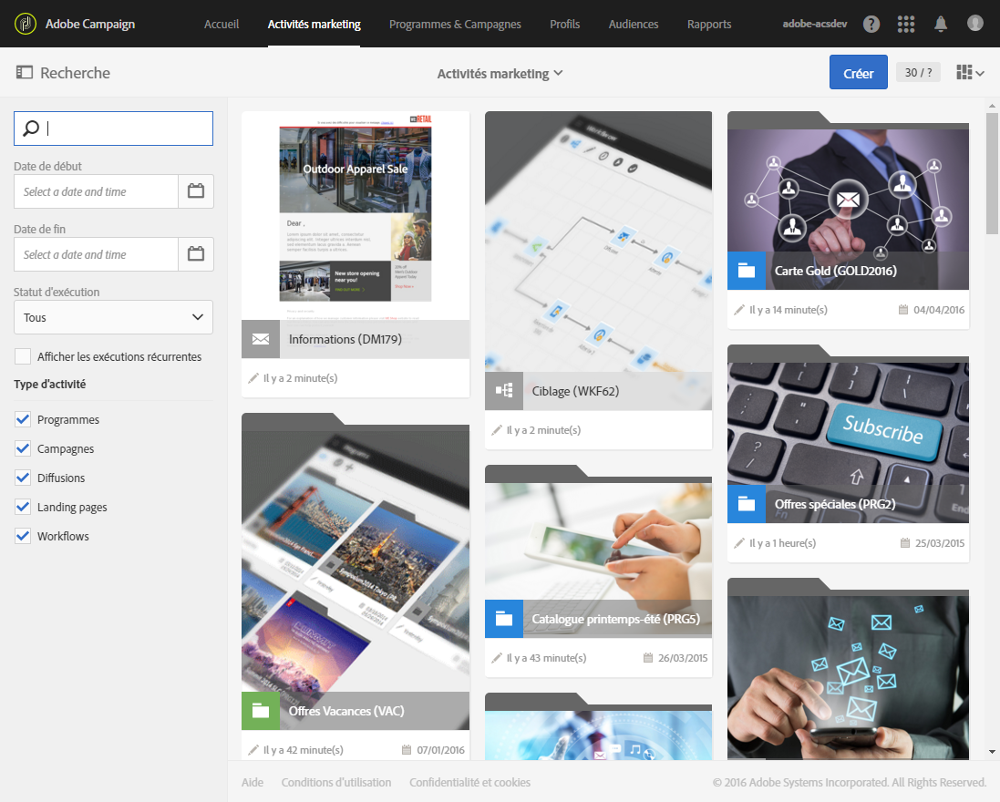
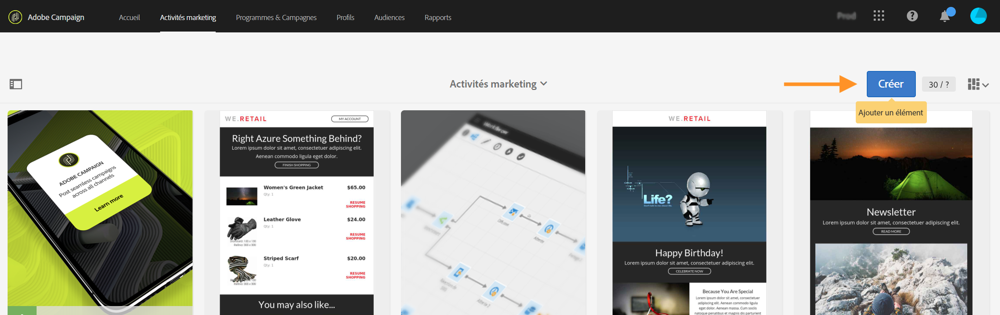
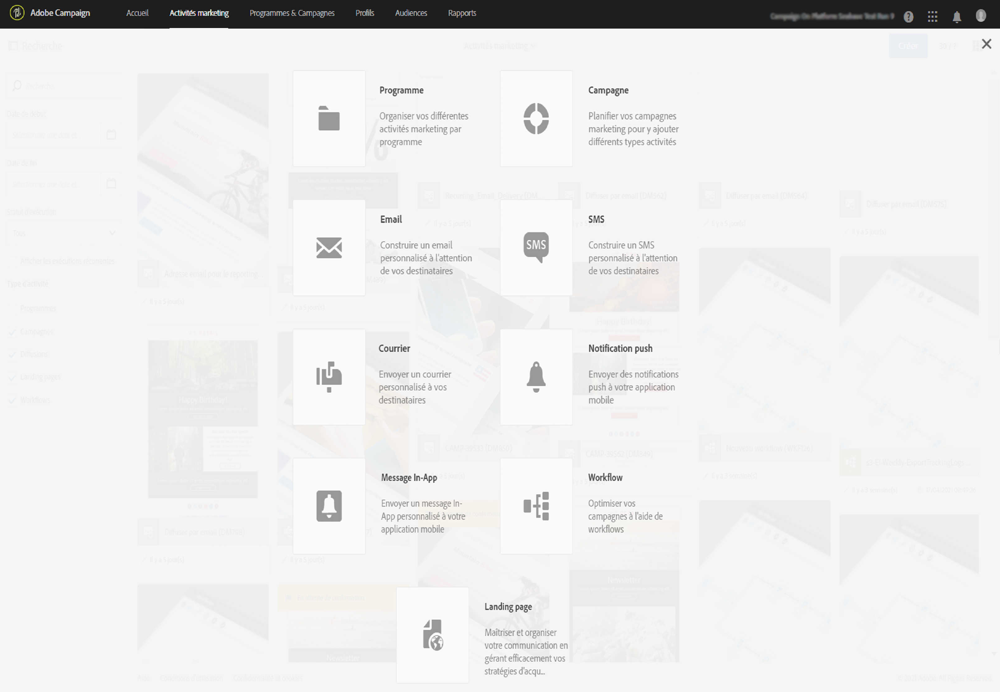

# Activités marketing{#marketing-activities}

## A propos des activités marketing {#about-marketing-activities}

Vous pouvez créer et gérer les activités marketing depuis les programmes et les campagnes auxquels elles appartiennent, ou via la liste des activités marketing.

La liste des activités marketing centralise toutes les activités, quels que soient les programmes ou les campagnes dans lesquels elles ont été créées. Programmes, campagnes, diffusions (emails, SMS et notifications push), landing pages et workflows sont ainsi répertoriés sans aucune notion de hiérarchie.

Pour accéder à la liste des activités marketing, sélectionnez le lien **[!UICONTROL Activités marketing]** dans la barre supérieure.

>[!NOTE]
>
>Depuis la page d'accueil, les activités sont également accessibles depuis la vignette **[!UICONTROL Activités marketing]**.

Le volet **[!UICONTROL Recherche]** permet de filtrer les éléments selon différents critères : par nom (libellé et identifiant), date, statut ou type d'activité. Par défaut, tous les types d'activité sont sélectionnés, à l'exception des programmes.

Pour accéder directement au contenu de chaque activité, choisissez un des éléments de la liste.

Le bouton **[!UICONTROL Créer]** peut être utilisé pour créer une autre activité. Consultez la section [Créer une activité marketing](../../start/using/marketing-activities.md#creating-a-marketing-activity) pour en savoir plus.

## Icônes et statuts des activités marketing   {#marketing-activity-icons-and-statuses}

Dans la zone principale, chaque type d'activité de la liste est caractérisé par une icône :

*  : programme
*  : Campaign
*  : e-mail
*  : SMS
*  : notification push
*  : Message In-App
*  : landing page
*  : workflow

La couleur associée à cette icône indique le statut d'exécution de l'activité correspondante, en fonction de sa période de validité et de son état.

* Gris : l'activité n'a pas encore commencé - statut **[!UICONTROL En édition]**.
* Bleu : l'activité est en cours - statut **[!UICONTROL En cours]**.
* Vert : l'activité est terminée - statut **[!UICONTROL Terminé]**.
* Jaune : l'activité a fait l'objet d'un avertissement - statut **[!UICONTROL Avertissement]**.
* Rouge : une erreur est survenue - statut **[!UICONTROL En erreur]**.

## Créer une activité marketing {#creating-a-marketing-activity}

Depuis une campagne existante, vous pouvez créer différents types de messages (**email**, **SMS**, **notification push**, etc.), des workflows et des landing pages.

Depuis un programme existant, vous pouvez créer d'autres programmes, des campagnes, des workflows et des landing pages.

>[!NOTE]
>
>Envisagez de créer les workflows directement dans une campagne. Si vous créez un workflow dans un programme, vous ne serez pas en mesure de le déplacer ensuite vers une campagne.

Les programmes et les campagnes sont présentés dans la section [Programmes et campagnes](../../start/using/programs-and-campaigns.md).

1. Dans le tableau de bord d'un programme ou d'une campagne, créez une activité marketing à l'aide du bouton **[!UICONTROL Créer]**.

   

1. Sélectionnez le type d'activité que vous souhaitez créer.

   

Selon le contexte, vous pouvez :

* [créer un email,](../../channels/using/creating-an-email.md)
* [créer un SMS,](../../channels/using/creating-an-sms-message.md)
* [créer une notification push,](../../channels/using/preparing-and-sending-a-push-notification.md)
* [créer un message In-App,](../../channels/using/about-in-app-messaging.md)
* [créer un workflow,](../../automating/using/building-a-workflow.md#creating-a-workflow)
* [créer une landing page,](../../channels/using/about-landing-pages.md)
* [créer une campagne,](../../start/using/programs-and-campaigns.md#creating-a-campaign)
* [créer un programme](../../start/using/programs-and-campaigns.md#creating-a-program)

>[!NOTE]
>
>Vous pouvez également créer une activité marketing depuis la liste des activités marketing. Dans ce cas, vous pouvez créer n'importe quel type d'activité. Vous pouvez choisir d'associer l'activité marketing à une campagne parente (ou à un programme parent si vous créez un programme) via les propriétés de l'activité.

