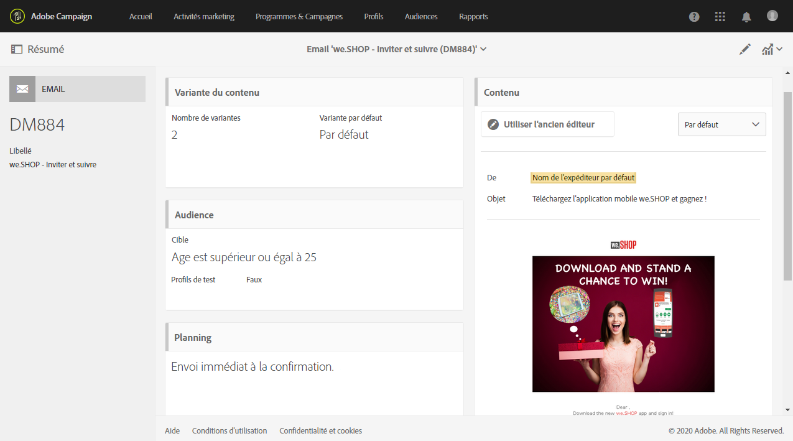
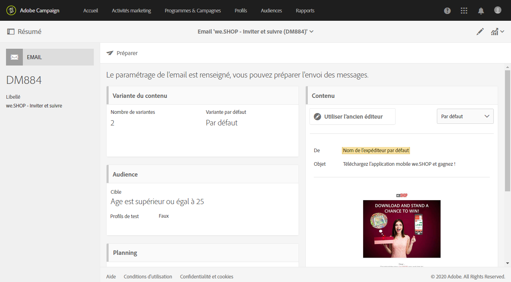

# Modèles d&#39;activité marketing {#marketing-activity-templates}

## Modèles {#about-templates}

Lorsque vous créez une activité marketing, le premier écran de l&#39;assistant vous invite à sélectionner un type – ou modèle. Les modèles vous permettent de préconfigurer certains paramètres selon vos besoins. Le modèle peut contenir un paramétrage complet ou partiel de l&#39;activité marketing. La gestion des modèles est effectuée par l&#39;administrateur fonctionnel.

L&#39;utilisateur final bénéficie d&#39;une interface simplifiée. Lors de la création d&#39;une activité marketing, il lui suffit de sélectionner le modèle souhaité. Il n&#39;a pas à se soucier du paramétrage technique. Celui-ci a en effet été pré-configuré par l&#39;administrateur fonctionnel dans le modèle.

Par exemple, dans le cas d&#39;un modèle d&#39;email, vous pouvez pré-renseigner le contenu HTML, l&#39;audience et tout autre paramètre de votre diffusion : planning, profils de test, propriétés générales de la diffusion, paramètres avancés, etc. Vous gagnez ainsi du temps lors de la création d&#39;une activité.

Pour chaque type d&#39;activité marketing, un ou plusieurs modèles d&#39;usine sont proposés. Ils proposent un paramétrage minimal pour chaque type d&#39;activité marketing. Ces modèles d&#39;usine ne peuvent être ni modifiés, ni supprimés.

Des modèles sont disponibles pour les activités marketing suivantes :

* Programmes
* Opérations
* Diffusions Email
* Diffusions SMS
* Notifications push
* Landing pages
* Workflows
* Services
* Import
* Messages transactionnels

## Créer un modèle {#creating-a-new-template}

Les modèles de message peuvent être gérés par l&#39;administrateur fonctionnel de la plate-forme, depuis le menu **[!UICONTROL Ressources > Modèles]**. Les modèles d&#39;usine ne peuvent être ni modifiés, ni supprimés. Pour créer un modèle, vous devez en dupliquer un existant.

1. Sélectionnez un modèle existant. Dans notre exemple, nous avons choisi un **[!UICONTROL Modèle de diffusion]**.

   

1. Survolez-le avec la souris, puis sélectionnez l&#39;option **[!UICONTROL Dupliquer l&#39;élément]**.

   

1. Configurez les paramètres de votre choix comme vous le feriez lors de la [création d&#39;une activité marketing](../../start/using/marketing-activities.md#creating-a-marketing-activity).

   

Les modèles créés peuvent être ensuite sélectionnés par un utilisateur standard dans le premier écran de l&#39;assistant lors de la création d&#39;une activité marketing.

## Utiliser un modèle {#using-a-template}

Voyons à présent comment utiliser un modèle créé dans la section précédente.

>[!NOTE]
>
>La création d&#39;une activité marketing basée sur un modèle est en général réalisée par un profil de type utilisateur standard.

1. Créez une activité marketing.

   

1. Dans le premier écran de l&#39;assistant, sélectionnez le modèle que vous souhaitez utiliser.

   

   L&#39;activité marketing est pré-configurée avec les paramètres définis dans le modèle.

   
