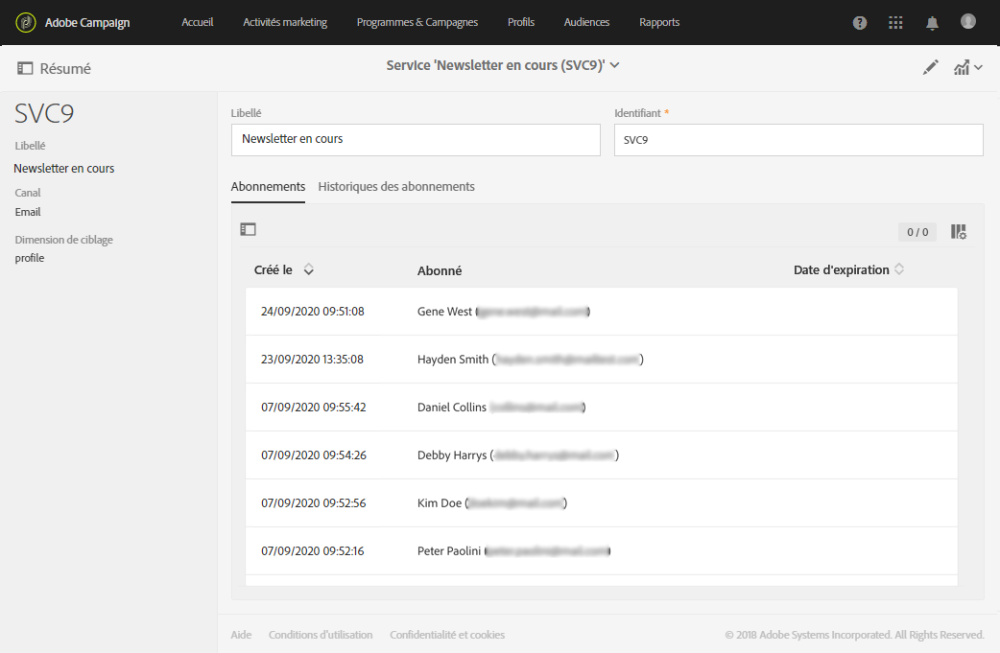

# Gestion de la confidentialité {#privacy-management}

Adobe Campaign propose un ensemble d’outils pour vous aider à vous conformer aux règlements sur la protection des données (notamment le RGPD, CCPA, PDPA, LGDP).

* This section presents general information on what Privacy management is and the features provided by Adobe Campaign to manage the [Right to Access and Right to be Forgotten](#right-access-forgotten).

* Il contient également des informations sur les fonctions importantes de gestion de la confidentialité ([consentement, rétention des données et rôles](#consent-retention-roles)utilisateur), ainsi que les meilleures pratiques pour vous aider à respecter vos exigences en matière de confidentialité lors de l’utilisation de Adobe Campaign.

## Règlement sur la gestion de la vie privée {#privacy-management-regulations}

Les fonctionnalités d’Adobe Campaign vous aident à respecter les réglementations suivantes :

* **Le RGPD** ([Règlement général sur la protection des données](https://ec.europa.eu/info/law/law-topic/data-protection/reform/what-does-general-data-protection-regulation-gdpr-govern_en)) est la loi de l’Union européenne (UE) sur la protection de la vie privée. Il harmonise et modernise les exigences en matière de protection des données.
* **Le CCPA** ([California Consumer Privacy Act](https://leginfo.legislature.ca.gov/faces/codes_displayText.xhtml?lawCode=CIV&amp;division=3.&amp;title=1.81.5.&amp;part=4.&amp;chapter=&amp;article=)) fournit aux résidents de la Californie de nouveaux droits relatifs aux informations personnelles et impose des responsabilités en matière de protection des données à certaines entités qui exercent des activités en Californie.
* **PDPA** ([Personal Data Protection Act](https://secureprivacy.ai/thailand-pdpa-summary-what-businesses-need-to-know/)) est la nouvelle loi sur la protection de la vie privée qui harmonise et modernise les exigences de protection des données en Thaïlande.
* **Le LGPD** ([Lei Geral de Proteção de Dados](https://iapp.org/media/pdf/resource_center/Brazilian_General_Data_Protection_Law.pdf)) entrera en vigueur début 2021 pour toutes les sociétés qui collectent ou traitent des données personnelles au Brésil.

Tous ces règlements s’appliquent aux clients Adobe Campaign qui détiennent des données pour les titulaires de données résidant dans les régions ou pays respectifs mentionnés ci-dessus (UE, Californie, Thaïlande, Brésil).

>[!NOTE]
>
>Pour plus d’informations sur les données personnelles et sur les différentes entités qui gèrent les données (Contrôleur de données, Responsable du traitement des données et Titulaire de données), consultez [Données personnelles et acteurs impliqués](../../start/using/privacy.md#personal-data).

## Droit d&#39;accès et droit à l&#39;oubli {#right-access-forgotten}

In order to help you facilitate your Privacy readiness, Adobe Campaign allows you to handle **Access** and **Delete** requests.

* The **Right to Access** is the right for the Data Subject to obtain from the Data Controller confirmation as to whether or not personal data concerning them is being processed, where and for what purpose. Le contrôleur de données doit fournir gratuitement une copie des données personnelles dans un format électronique.

* Egalement appelé Effacement des données, le **Droit à l&#39;oubli** (demande de suppression) autorise le titulaire des données à demander au contrôleur de données d&#39;effacer ses données personnelles, de cesser la diffusion des données et de faire cesser éventuellement le traitement des données par des tiers.

To learn how you can create **Access** and **Delete** requests and how Adobe Campaign processes them, refer to the [implementation steps](../../start/using/privacy-requests.md#about-privacy-requests).

Tutorials on Privacy management in Campaign Standard are also available [here](https://experienceleague.adobe.com/docs/campaign-standard-learn/tutorials/privacy/privacy-overview.html?lang=en#privacy).

## Consentement, conservation des données et rôles {#consent-retention-roles}

In addition to the most recent **Right to Access** and **Right to be Forgotten** capabilities, Adobe Campaign offers other important features that are essential to Privacy:

* [Gestion du consentement](#consent-management) : fonctionnalité d&#39;abonnement pour la gestion des préférences.
* [Conservation des données](#data-retention) : périodes de conservation des données pour toutes les tables de logs d&#39;usine ; des périodes de conservation supplémentaires peuvent être configurées avec des workflows.
* [Gestion des droits](#rights-management) : accès aux données géré par les droits nommés

### Gestion du consentement {#consent-management}

Le consentement signifie l&#39;accord donné par le titulaire des données pour le traitement des données personnelles le concernant. C&#39;est le contrôleur des données qui est responsable d&#39;obtenir les consentements nécessaires pour ce traitement. Bien qu&#39;Adobe Campaign puisse proposer certaines fonctionnalités permettant à un client de gérer les consentements relatifs au service, Adobe n&#39;est pas responsable des consentements. Les clients doivent collaborer avec leurs services juridiques pour établir leurs propres procédures et pratiques pour tout consentement nécessaire.

Depuis le début, Adobe Campaign se sert de certaines fonctions pour gérer certains aspects du consentement. Grâce au processus de gestion des abonnements, les clients peuvent identifier les destinataires qui ont choisi le type d&#39;abonnement, qu&#39;il s&#39;agisse de bulletins d&#39;information, de promotions quotidiennes ou hebdomadaires ou de tout autre type de programme marketing.

Pour plus d’informations sur la gestion du consentement, voir [A propos des abonnements](../../audiences/using/about-subscriptions.md) et [Commencer avec les landings page](../../channels/using/getting-started-with-landing-pages.md).

En plus des outils de gestion du consentement fournis par Adobe Campaign, vous avez la possibilité de déterminer si un consommateur a choisi de ne pas vendre de renseignements personnels. Reportez-vous à [cette section](../../start/using/privacy-requests.md#sale-of-personal-information-ccpa).

### Conservation des données {#data-retention}

En ce qui concerne la rétention, les tables de journalisation intégrées à Campaign comportent des périodes de rétention prédéfinies, limitant généralement leur enregistrement de données à six mois ou moins.

Vous trouverez ci-dessous les valeurs de conservation par défaut pour les tables d’usine. Notez que la configuration de conservation est définie par les administrateurs techniques Adobe lors de la mise en œuvre et que les valeurs peuvent varier pour chaque mise en œuvre, selon les exigences du client.

* **Tracking consolidé** : 6 mois
* **Logs de diffusion** : 6 mois
* **Logs de tracking** : 6 mois
* **Evénements** : 1 mois
* **Statistiques du traitement des événements** : 6 mois
* **Evénements historisés** : 6 mois
* **Entités temporaires** : 7 jours
* **Evénements Pipeline ignorés** : 1 mois
* **Alertes de diffusion** : 1 mois
* **Audits des exports** : 6 mois

Tout comme pour la suppression, il est possible de configurer des périodes de conservation des données pour des tables personnalisées en utilisant les fonctionnalité d&#39;usine des workflows.

Pour en savoir plus sur la conservation des données ou pour définir des périodes de conservation pour les tables personnalisées, contactez les consultants ou les administrateurs techniques Adobe.

### Gestion des droits {#rights-management}

Adobe Campaign permet de gérer les droits assignés aux divers opérateurs Campaign par l’intermédiaire de différents rôles préconfigurés ou personnalisés.

Cela vous permet de gérer qui dans votre société peut accéder à différents types de données. Par exemple, plusieurs responsables marketing peuvent couvrir des secteurs géographiques différents en n’ayant accès qu’aux données de leur secteur.

De même, cette fonctionnalité vous permet également de configurer différentes fonctionnalités pour chaque utilisateur, telles que la limitation des destinataires autorisés à envoyer des diffusions, ou plus pertinentes pour la gestion de la confidentialité, qui peuvent modifier ou exporter des données.

For more on access management, see [this section](../../administration/using/about-access-management.md).