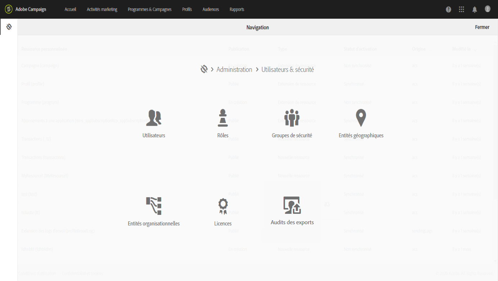

# Gestion de la confidentialité {#privacy-management}

Adobe Campaign offers a set of tools to help you comply with [Privacy regulations](#privacy-management-regulations) (including GDPR, CCPA, PDPA, LGPD).

Voici les cinq principales capacités offertes par l&#39;Adobe Campaign pour s&#39;assurer que le RMPE et d&#39;autres règlements sur la protection des renseignements personnels sont prêts :

* **Droit d&#39;accès**

* **Droit de supprimer**

Pour plus d&#39;informations à ce sujet, voir [Droit d&#39;accès et Droit à l&#39;oubli](#right-access-forgotten).

* **Gestion du consentement**

* **Conservation des données**

* **Gestion des droits**

Pour plus d’informations à ce sujet, voir [Consentement, Rétention et rôles](#consent-retention-roles).

<!--This section presents general information on what Privacy management is and the features provided by Adobe Campaign to manage the [Right to Access and Right to be Forgotten](#right-access-forgotten).

It also contains information on important features to manage Privacy ([consent, data retention and user roles](#consent-retention-roles)), as well as best practices to help you with your Privacy compliance when using Adobe Campaign.-->

## Regulations on Privacy management {#privacy-management-regulations}

Les fonctionnalités d&#39;Adobe Campaign vous aident à respecter les réglementations suivantes :

* **Le RGPD** ([Règlement général sur la protection des données](https://ec.europa.eu/info/law/law-topic/data-protection/reform/what-does-general-data-protection-regulation-gdpr-govern_fr)) est la loi de l&#39;Union européenne (UE) sur la protection de la vie privée. Il harmonise et modernise les exigences en matière de protection des données. Suivez les liens ci-dessous pour obtenir des renseignements généraux sur le RMPD :

   * https://www.adobe.com/fr/privacy/general-data-protection-regulation.html
   * https://www.adobe.com/fr/marketing-cloud/campaign/general-data-protection-regulation.html

* **Le CCPA** ([California Consumer Privacy Act](https://leginfo.legislature.ca.gov/faces/codes_displayText.xhtml?lawCode=CIV&amp;division=3.&amp;title=1.81.5.&amp;part=4.&amp;chapter=&amp;article=)) fournit aux résidents de la Californie de nouveaux droits relatifs aux informations personnelles et impose des responsabilités en matière de protection des données à certaines entités qui exercent des activités en Californie.
* **Le PDPA** ([Personal Data Protection Act)](https://secureprivacy.ai/thailand-pdpa-summary-what-businesses-need-to-know/) est la nouvelle loi sur la protection de la vie privée qui harmonise et modernise les exigences en matière de protection des données en Thaïlande.
* **Le LGPD** ([Lei Geral de Proteção de Dados](https://iapp.org/media/pdf/resource_center/Brazilian_General_Data_Protection_Law.pdf)) entrera en vigueur début 2021 pour toutes les sociétés qui collectent ou traitent des données personnelles au Brésil.

Tous ces règlements s&#39;appliquent aux clients Adobe Campaign qui détiennent des données pour les titulaires de données résidant dans les régions ou pays respectifs mentionnés ci-dessus (UE, Californie, Thaïlande, Brésil).

>[!NOTE]
>
>Pour plus d&#39;informations sur les données personnelles et sur les différentes entités qui gèrent les données (Contrôleur de données, Responsable du traitement des données et Titulaire de données), consultez [Données personnelles et acteurs impliqués](../../start/using/privacy.md#personal-data).

## Droit d&#39;accès et droit à l&#39;oubli {#right-access-forgotten}

Pour faciliter la préparation à la protection des données, Adobe Campaign permet désormais de gérer les demandes d&#39;**Accès** et de **Suppression**.

* Le **droit d&#39;accès** est le droit pour le titulaire de données d&#39;obtenir du contrôleur de données la confirmation que les données personnelles le concernant sont ou non traitées, et lorsqu&#39;elles le sont, où et à quelles fins. Le contrôleur de données doit fournir gratuitement une copie des données personnelles dans un format électronique.

* Également appelé Effacement des données, le **Droit à l&#39;oubli** (demande de suppression) autorise le titulaire des données à demander au contrôleur de données d&#39;effacer ses données personnelles, de cesser la diffusion des données et de faire cesser éventuellement le traitement des données par des tiers.

Pour découvrir comment créer des demandes d&#39;**Accès** et de **Suppression**, et comment elles sont traitées par Adobe Campaign, consultez les [étapes d&#39;implémentation](../../start/using/privacy-requests.md#about-privacy-requests).

Vous trouverez également des informations sur la gestion de la protection des données dans Campaign Standard [ici](https://experienceleague.adobe.com/docs/campaign-standard-learn/tutorials/privacy/privacy-overview.html?lang=fr#privacy).

>[!NOTE]
>
>Pour plus d&#39;informations sur les données personnelles et sur les différentes entités qui gèrent les données (Contrôleur de données, Responsable du traitement des données et Titulaire de données), consultez [Données personnelles et acteurs impliqués](../../start/using/privacy.md#personal-data).

## Consentement, conservation des données et rôles {#consent-retention-roles}

En plus des dernières options **Droit d&#39;accès** et **Droit à l&#39;oubli**, Adobe Campaign propose d&#39;autres fonctionnalités importantes qui sont essentielles pour la protection des données :

* [Gestion du consentement](#consent-management) : fonctionnalité d&#39;abonnement pour la gestion des préférences.
* [Conservation des données](#data-retention) : périodes de conservation des données pour toutes les tables de logs d&#39;usine ; des périodes de conservation supplémentaires peuvent être configurées avec des workflows.
* [Gestion des droits](#rights-management) : accès aux données géré par les droits nommés

### Gestion du consentement {#consent-management}

Le consentement signifie l&#39;accord donné par le titulaire des données pour le traitement des données personnelles le concernant. C&#39;est le contrôleur des données qui est responsable d&#39;obtenir les consentements nécessaires pour ce traitement. Bien qu&#39;Adobe Campaign puisse proposer certaines fonctionnalités permettant à un client de gérer les consentements relatifs au service, Adobe n&#39;est pas responsable des consentements. Les clients doivent collaborer avec leurs services juridiques pour établir leurs propres procédures et pratiques pour tout consentement nécessaire.

Depuis le début, Adobe Campaign se sert d&#39;un certain nombre de fonctions pour gérer certains aspects du consentement. Grâce au processus de gestion des abonnements, les clients peuvent déterminer quels destinataires ont choisi quel type d&#39;abonnement, qu&#39;il s&#39;agisse de newsletters, de promotions quotidiennes ou hebdomadaires ou de tout autre type de programme marketing.

Pour plus d&#39;informations sur la gestion du consentement, voir [À propos des abonnements](../../audiences/using/about-subscriptions.md) et [Prise en main des landing pages](../../channels/using/getting-started-with-landing-pages.md).

Outre les outils de gestion du consentement fournis par Adobe Campaign, vous pouvez suivre si un client s&#39;est opposé à la vente de ses informations personnelles. Reportez-vous à [cette section](../../start/using/privacy-requests.md#sale-of-personal-information-ccpa).

### Conservation des données {#data-retention}

En ce qui concerne la conservation des données, les tables de logs d&#39;usine de Campaign possèdent des périodes de conservation prédéfinies, limitant généralement le stockage des données à 6 mois ou moins.

Vous trouverez ci-dessous les valeurs de conservation par défaut pour les tables d’usine. Notez que la configuration de conservation est définie par les administrateurs techniques Adobe lors de la mise en œuvre et que les valeurs peuvent varier pour chaque mise en œuvre, selon les exigences du client.

* **Tracking consolidé** : 6 mois
* **Logs de diffusion** : 6 mois
* **Logs de tracking** : 6 mois
* **Evénements** : 1 mois
* **Statistiques du traitement des événements** : 6 mois
* **Evénements historisés** : 6 mois
* **Entités temporaires** : 7 jours
* **Evénements Pipeline ignorés** : 1 mois
* **Alertes de diffusion** : 1 mois
* **Audits des exports** : 6 mois

Tout comme pour la suppression, il est possible de configurer des périodes de conservation des données pour des tables personnalisées en utilisant les fonctionnalités d&#39;usine des workflows.

Pour en savoir plus sur la conservation des données ou pour définir des périodes de conservation pour les tables personnalisées, contactez les consultants ou les administrateurs techniques d&#39;Adobe.

### Gestion des droits {#rights-management}

Adobe Campaign permet de gérer les droits assignés aux divers opérateurs Campaign par l&#39;intermédiaire de différents rôles préconfigurés ou personnalisés.

Vous pouvez ainsi gérer qui, dans votre entreprise, peut accéder à différents types de données. Par exemple, plusieurs responsables marketing peuvent couvrir des secteurs géographiques différents en n&#39;ayant accès qu&#39;aux données de leur secteur.

De même, cette fonctionnalité vous permet de configurer différentes fonctionnalités pour chaque utilisateur, telles que la limitation des expéditeurs autorisés à envoyer des diffusions. Il est même possible, en rapport avec la confidentialité, de déterminer qui peut modifier ou exporter des données.

Pour plus d&#39;informations sur la gestion des accès, consultez [cette section](../../administration/using/about-access-management.md).