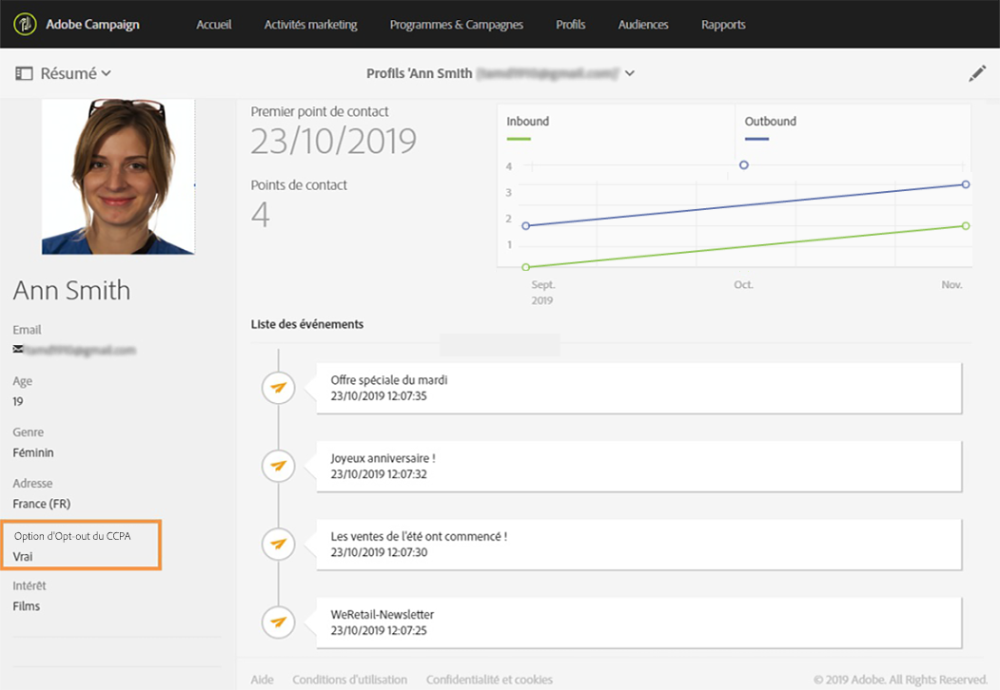

# Managing Privacy requests {#privacy-requests}

For a general presentation on Privacy Management, refer to [this section](../../start/using/privacy-management.md).

Ces informations s’appliquent au RGPD, au CCPA, au PDPA et au LGPD. Pour plus d’informations sur ces règlementations, consultez [cette section](../../start/using/privacy-management.md#privacy-management-regulations).

The opt-out for the Sale of Personal Information, which is specific to CCPA, is explained in [this section](#sale-of-personal-information-ccpa).

>[!IMPORTANT]
>
>À compter de la version 19.4, l’utilisation de l’API et de l’interface de Campaign pour les demandes d’accès et de suppression devient obsolète. Pour toute demande d’accès et de suppression GDPR, CCPA, PDPA ou LGPD, vous devez utiliser la méthode d’intégration [Privacy Core Service](#create-privacy-request) .

## About Privacy requests {#about-privacy-requests}

Afin de vous aider à vous préparer à la protection de la vie privée, Adobe Campaign vous permet de traiter les demandes d&#39;accès et de suppression. Le **droit d&#39;accès** et le **droit d&#39;être oublié** (demande de suppression) sont décrits dans [cette section](../../start/using/privacy-management.md#right-access-forgotten).

Pour exécuter ces requêtes, vous devez utiliser l’intégration de **Privacy Core Service** . Les demandes d’accès à des informations personnelles transmises par Privacy Core Service à toutes les solutions Experience Cloud sont automatiquement traitées par Campaign via un workflow dédié.

### Prérequis {#prerequesites}

Outils des contrôleurs de données des offres Adobe Campaign pour créer et traiter les demandes de confidentialité pour les données stockées dans Adobe Campaign. Il incombe toutefois au contrôleur de données de gérer la relation avec le titulaire de données (email, service à la clientèle ou portail web).

Par conséquent, il est de votre responsabilité, en tant que contrôleur de données, de vérifier l’identité du titulaire de données à l’origine de la demande et de confirmer que les données renvoyées au demandeur concernent le titulaire de données.

>[!NOTE]
>
>Pour plus d’informations sur les données personnelles et sur les différentes entités qui gèrent les données (Contrôleur de données, Responsable du traitement des données et Titulaire de données), consultez [Données personnelles et acteurs impliqués](../../start/using/privacy.md#personal-data).

### Espaces de nommage {#namesspaces}

Avant de créer des requêtes de confidentialité, vous devez définir l’espace de nommage que vous utiliserez. L’espace de noms est la clé qui sera utilisée pour identifier le titulaire de données dans la base de données Adobe Campaign. Deux espaces de noms d’usine sont disponibles : email et téléphone mobile. Si vous avez besoin d’un autre espace de noms (un champ personnalisé de profil, par exemple), suivez les étapes ci-dessous.

Also refer to this [tutorial](https://experienceleague.adobe.com/docs/campaign-standard-learn/tutorials/privacy/namespaces-for-privacy-requests.html?lang=en#privacy) on how to create a namespace.

>[!NOTE]
>
>Si vous utilisez plusieurs espaces de nommage, vous devez créer une demande de confidentialité par espace de nommage.

1. Cliquez sur le logo Adobe Campaign, en haut à gauche, puis sélectionnez **[!UICONTROL Administration]** > **[!UICONTROL Espaces de nommage]**.

   

1. Dans la liste des espaces de nommage, cliquez sur **[!UICONTROL Créer]**.

   

1. Saisissez un **[!UICONTROL Libellé]**.

   

1. If you want to use an existing identity service namespace, choose **[!UICONTROL Map from Identity Namespace Service]** and select a namespace from the **[!UICONTROL Identity Service Namespaces]** list.

   

   If you want to create a new namespace in **[!UICONTROL Identity Service]** and map it in Campaign, select **[!UICONTROL Create new]** and enter a name in the **[!UICONTROL Identity namespace name]** field.

   

   Pour en savoir plus sur les espaces de nommage d&#39;identité, consultez la documentation de l&#39; [Experience Platform](https://experienceleague.adobe.com/docs/experience-platform/identity/namespaces.html?lang=en) .

1. Un Espace de nommage de service d&#39;identité est mappé à un espace de nommage de Campaign. Vous devez indiquer comment l’espace de nommage sera réconcilié dans Campaign.

   Sélectionnez un mapping de ciblage (**[!UICONTROL Destinataires]**, événement **** en temps réel ou **[!UICONTROL Abonnements à une application]**). Si vous souhaitez utiliser plusieurs mappings de ciblage, vous devez créer un espace de noms par mapping de ciblage.

   

1. Sélectionnez la **[!UICONTROL Clé de réconciliation]**. Il s&#39;agit du champ qui sera utilisé pour identifier le titulaire de données dans la base de données Adobe Campaign.

   

1. Cliquez sur **[!UICONTROL Créer]**. Vous pouvez désormais créer des requêtes de confidentialité en fonction de votre nouvel espace de nommage. Si vous utilisez plusieurs espaces de nommage, vous devez créer une demande de confidentialité par espace de nommage.

### Creating a Privacy request {#create-privacy-request}

>[!IMPORTANT]
>
>The **Privacy Core Service** integration is the method you should use for all Access and Delete requests.
>
>À compter de la version 19.4, l’utilisation de l’API et de l’interface de Campaign pour les demandes d’accès et de suppression devient obsolète. Utilisez Privacy Core Service pour toute demande d‘accès et de suppression relative au RGPD, CCPA, PDPA ou LGPD.

L’intégration de Privacy Core Service vous permet d’automatiser vos requêtes de confidentialité dans un contexte multisolution par le biais d’un seul appel d’API JSON. Les demandes d’accès à des informations personnelles transmises par Privacy Core Service à toutes les solutions Experience Cloud sont automatiquement traitées par Campaign via un workflow dédié.

Refer to the [Experience Platform Privacy Service](https://experienceleague.adobe.com/docs/experience-platform/privacy/home.html?lang=en) documentation to learn how to create Privacy requests from the Privacy Core Service.

Chaque tâche de service principal Confidentialité est divisée en plusieurs requêtes Confidentialité dans Campaign en fonction du nombre d’espaces de nommage utilisés, une requête correspondant à un espace de nommage. En outre, une tâche peut être exécutée sur plusieurs instances. C’est pourquoi plusieurs fichiers sont créés pour un seul traitement. Par exemple, si une demande contient deux espaces de noms et est exécutée sur trois instances, six fichiers sont envoyés. Soit un fichier par espace de noms et par instance.

Le modèle d’un nom de fichier est le suivant : `<InstanceName>-<NamespaceId>-<ReconciliationKey>.xml`

* **NomInstance** : nom de l’instance dans Campaign
* **NamespaceId**: ID d&#39;Espace de nommage du service d&#39;identité de l&#39;espace de nommage utilisé
* **CléRéconciliation** : clé de réconciliation encodée

### Liste des ressources {#list-of-resources}

When performing a Delete or Access Privacy request, Adobe Campaign searches all the Data Subject&#39;s data based on the **Reconciliation** value in all the resources that have a link to the profiles resource (own type).

Voici la liste des ressources d’usine qui sont prises en compte lors de l’exécution des demandes d’accès à des données personnelles :

* Profils (recipient)
* Logs de diffusion des profils (broadLogRcp)
* Logs de tracking des profils (trackingLogRcp)
* Logs de diffusion (Abonnements à une application) (broadLogAppSubRcp)
* Logs de tracking (Abonnements à une application) (trackingLogAppSubRcp)
* Abonnements à une application (appSubscriptionRcp)
* Historique des abonnements des profils (subHistoRcp)
* Abonnements des profils (subscriptionRcp)
* Visiteurs (visitor)

Si vous avez créé des ressources personnalisées ayant un lien avec la ressource de profils (type own), celles-ci sont également prises en compte. Par exemple, si une ressource de transaction est liée à la ressource de profils et si une ressource de détails de transaction est liée à la ressource de transaction, elles sont toutes deux prises en compte.

Reportez-vous également à [ce tutoriel](https://experienceleague.adobe.com/docs/campaign-standard-learn/tutorials/privacy/custom-resources-for-privacy-requests.html?lang=en#privacy) sur la modification des ressources personnalisées.

Pour que cela fonctionne, vous devez sélectionner l&#39;option **[!UICONTROL La suppression de l&#39;enregistrement cible entraîne la suppression des enregistrements référencés par le lien]** dans la ressource personnalisée.

1. Cliquez sur le logo Adobe Campaign, en haut à gauche, puis sélectionnez **[!UICONTROL Administration]** > **[!UICONTROL Développement]** > **[!UICONTROL Ressources personnalisées]**.

1. Sélectionnez une ressource personnalisée qui a un lien vers la ressource profils (type own).

1. Click the **[!UICONTROL Links]** section.

1. For each link, click the pencil icon (**[!UICONTROL Edit properties]**).

1. Dans la section **[!UICONTROL Comportement en cas de suppression/duplication]**, sélectionnez l&#39;option **[!UICONTROL La suppression de l&#39;enregistrement cible entraîne la suppression des enregistrements référencés par le lien]**.

   

### Etat des requêtes de confidentialité {#privacy-request-statuses}

Voici les différents états des demandes de confidentialité :

* **[!UICONTROL Nouveau]**/**[!UICONTROL Reprise en attente]** : en cours, le workflow n&#39;a pas encore traité la demande.
* **[!UICONTROL Traitement]**/**[!UICONTROL Reprise en cours]** : le workflow traite la demande.
* **[!UICONTROL Suppression en attente]** : le workflow a identifié toutes les données du destinataire à supprimer.
* **[!UICONTROL Suppression en cours]** : le workflow traite la suppression.
   <!--**[!UICONTROL Delete Confirmation Pending]** (Delete request in 2-steps process mode): the workflow has processed the Access request. Manual confirmation is requested to perform the deletion. The button is available for 15 days.-->
* **[!UICONTROL Terminé]** : le traitement de la demande s&#39;est terminé sans erreur.
* **[!UICONTROL Erreur]**: le processus a rencontré une erreur. The reason is displayed in the list of Privacy requests in the **[!UICONTROL Request status]** column. For example, **[!UICONTROL Error data not found]** means that no recipient data matching the Data Subject&#39;s **[!UICONTROL Reconciliation value]** has been found in the database.

### Désactivation du processus en deux étapes {#disabling-two-step-process}

Privacy Core Service ne prend pas en charge le processus en deux étapes.

>[!IMPORTANT]
>
>Avant d’utiliser l’intégration de Privacy Core Service pour gérer vos demandes d’accès à des informations personnelles, vous devez désactiver le processus en deux étapes pour les demandes de suppression depuis l’interface de Campaign Standard.

Si cette option n’est pas désactivée, toutes les demandes de suppression gérées avec Privacy Core Service resteront en attente et ne seront pas terminées.

Par défaut, le processus en deux étapes est activé.

Pour modifier ce mode, cliquez sur **[!UICONTROL Modifier les propriétés]**, dans le coin supérieur droit de l’écran Demandes **[!UICONTROL de]** confidentialité, puis désactivez l’option **[!UICONTROL Activer le processus]** en deux étapes.

## Droit d’opposition (opt-out) à la vente des informations personnelles (CCPA) {#sale-of-personal-information-ccpa}

The **California Consumer Privacy Act** (CCPA) provides California residents new rights in regards to their personal information and imposes data protection responsibilities on certain entities whom conduct business in California.

La configuration et l’usage des demandes d’accès et de suppression sont identiques pour le RGPD et le CCPA. Cette section présente le droit d’opposition à la vente des données personnelles, qui est spécifique au CCPA.

In addition to the [Consent management](../../start/using/privacy-management.md#consent-management) tools provided by Adobe Campaign, you have the possibility to track whether a consumer has opted-out for the Sale of Personal Information.

Un consommateur décide, par l&#39;intermédiaire de votre système, qu&#39;il n&#39;autorise pas la vente de ses renseignements personnels à un tiers. En Adobe Campaign, vous pourrez stocker et suivre ces informations.

>[!NOTE]
>
>Vous pouvez exploiter l’opt-out de la vente des informations personnelles via l’API et l’interface de Campaign. Vous ne pouvez pas l’utiliser via le service principal de confidentialité.

>[!IMPORTANT]
>
>En tant que contrôleur des données, il vous incombe de recevoir la demande de la personne concernée et de suivre les dates de la demande d&#39;ACCP. En tant que fournisseur de technologies, nous ne fournissons qu&#39;un moyen de s&#39;exclure. Pour plus d’informations sur votre rôle en tant que contrôleur de données, voir Données [personnelles et Personnalités](../../start/using/privacy.md#personal-data).

### Condition préalable pour les tableaux personnalisés {#ccpa-prerequisite}

Starting 19.4, the **[!UICONTROL CCPA Opt-Out]** field is provided out-of-the-box in the Campaign interface and API. Par défaut, le champ est disponible pour la ressource **[!UICONTROL Profil]** standard.

Si vous utilisez une ressource de profil personnalisée, vous devez étendre la ressource et ajouter le champ. We recommend that you use a different name than the out-of-the-box field, for example:  **[!UICONTROL Opt-Out for CCPA]** (optoutccpa). Lorsqu’un champ est créé, il est automatiquement pris en charge par l’API Campaign.

For more detailed information on how to extend the profile resource, see [this section](../../developing/using/extending-the-profile-resource-with-a-new-field.md).

>[!NOTE]
>
>La modification des ressources est une opération sensible qui ne doit être effectuée que par des utilisateurs experts.

1. Accédez à **[!UICONTROL Administration]** > **[!UICONTROL Développement]** > Ressources **** personnalisées. Cliquez sur la ressource de profil personnalisée. For more on extending a resource, see [this section](../../developing/using/creating-or-extending-the-resource.md).

   

1. Click **[!UICONTROL Add field]** or **[!UICONTROL Create Element]**, add the label, ID and choose the **[!UICONTROL Boolean]** type. For the name, use **Opt-Out for CCPA**. Pour l’identifiant, utilisez :**optOutCcpa**.

   

1. Dans l’onglet **[!UICONTROL Définition des écrans]**, sous **[!UICONTROL Configuration de l’écran de détail]**, ajoutez le champ et sélectionnez **[!UICONTROL Champ de saisie]**. Le champ devient ainsi disponible dans les détails et la liste des profils.  For more on configuring the screen definition, see [this section](../../developing/using/configuring-the-screen-definition.md).

   

1. Go to **[!UICONTROL Administration]** > **[!UICONTROL Development]** > **[!UICONTROL Publishing]**, prepare the publication and publish the modifications. For more on publishing a resource, see [this section](../../developing/using/updating-the-database-structure.md).

   

1. Vérifiez que le champ est disponible sur les détails d’un profil. Voir à ce propos [cette section](#usage).

### Utilisation {#usage}

Il incombe au contrôleur des données de renseigner la valeur du champ et de respecter les lignes directrices et les règles de l&#39;ACCP concernant la vente de données.

Pour indiquer les valeurs, plusieurs méthodes peuvent être utilisées :

* Utilisation de l’interface de Campaign en modifiant les détails du destinataire (voir ci-dessous)
* Using the Campaign Privacy API (see the [API documentation](../../api/using/managing-ccpa-opt-out.md))
* par l’intermédiaire d’un workflow d’import de données.

Vous devez ensuite vous assurer de ne jamais vendre à une quelconque tierce partie les informations personnelles des profils qui s’y sont opposés.

1. Dans l’interface Campaign, modifiez un profil pour modifier l’état d’exclusion.

   

1. When the value of the field is **[!UICONTROL True]**, the information is displayed on the profile&#39;s details.

   

1. Vous pouvez configurer la liste des profils pour qu’elle affiche la colonne d’ouverture. Pour savoir comment configurer des listes, consultez [cette section](../../start/using/customizing-lists.md).

   

1. Vous pouvez cliquer sur la colonne pour trier les destinataires en fonction des informations d’exclusion.

   
