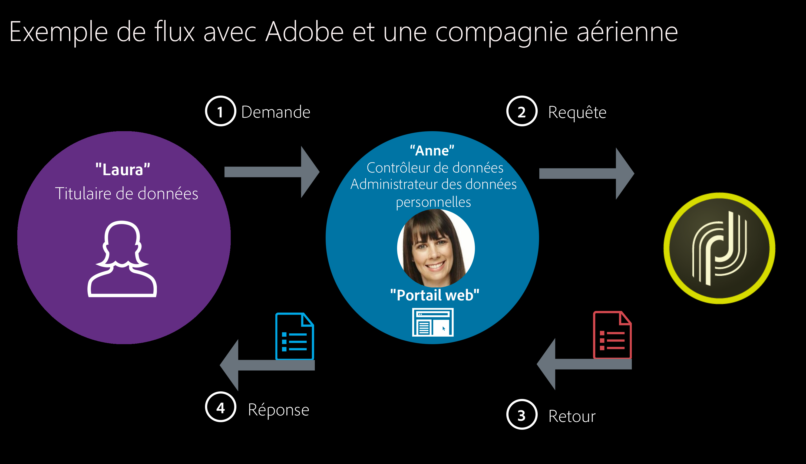

# Confidentialité et consentement {#privacy-and-consent}

## Recommandations générales {#general-recommendations}

Adobe Campaign est un outil puissant pour collecter et traiter de très grands volumes de données, notamment des informations personnelles et des données sensibles. La confidentialité doit donc être gérée avec soin.

* Utilisez toujours les informations personnelles de manière responsable et éthique.

* Évitez d&#39;envoyer des emails, des notifications push et des messages SMS non sollicités (« spam »). Adobe croit fermement aux principes du consentement (permission marketing) pour fidéliser le client et offrir une valeur ajoutée tout au long de sa durée de vie et interdit donc strictement l’utilisation d’Adobe Campaign pour l’envoi de messages non sollicités.

### Règlements relatifs à la confidentialité {#privacy-regulations}

Pour gérer correctement la confidentialité et les données personnelles, travaillez dans le cadre des législations applicables aux zones géographiques où vous intervenez. Ces règlements comprennent :
* [RGPD](https://ec.europa.eu/info/law/law-topic/data-protection/reform/what-does-general-data-protection-regulation-gdpr-govern_en) (Règlement général européen sur la protection des données)
* [DPA](https://www.gov.uk/data-protection) (mise en œuvre du RGPD au Royaume-Uni)
* [Directive européenne sur la protection de la vie privée et les communications électroniques](https://eur-lex.europa.eu/legal-content/EN/TXT/?uri=CELEX:02002L0058-20091219)
* [CAN-SPAM Act](https://www.ftc.gov/tips-advice/business-center/guidance/can-spam-act-compliance-guide-business) (loi des États-Unis fixant les règles et les exigences relatives aux emails commerciaux)
* [CCPA](https://leginfo.legislature.ca.gov/faces/codes_displayText.xhtml?lawCode=CIV&amp;division=3.&amp;title=1.81.5.&amp;part=4.&amp;chapter=&amp;article=) (California Consumer Privacy Act)
* [PDPA](https://secureprivacy.ai/thailand-pdpa-summary-what-businesses-need-to-know/) (loi thaïlandaise sur la protection des données personnelles)

>[!NOTE]
>
>For more on how GDPR, CCPA, PDPA, and LGPD apply to Adobe Campaign, see [this section](../../start/using/privacy-management.md#privacy-management-regulations).

### Confidentialité d&#39;Adobe Experience Cloud {#experience-cloud-privacy}

Adobe Campaign fait partie intégrante des solutions Adobe Experience Cloud. La gestion de la confidentialité dans Campaign obéit aux principes généraux d’Adobe Experience Cloud, notamment :

* **La nature des informations collectées lors de l’utilisation d’Adobe Experience Cloud**

   En tant que société utilisant les solutions Adobe Experience Cloud, vous choisissez les informations à collecter et à envoyer à votre compte Adobe Experience Cloud. Parmi les types d&#39;informations pouvant être collectées, citons les activités de navigation sur le Web, les adresses IP, les informations de localisation des appareils mobiles, les taux de succès des campagnes, les articles achetés ou placés dans un panier, etc.

   >[!NOTE]
   >
   >Comme pour tous les produits Adobe, Campaign collecte des informations relatives aux utilisateurs d&#39;applications et de sites web. Pour plus d&#39;informations à ce sujet, consultez la [Politique de confidentialité d&#39;Adobe](https://www.adobe.com/fr/privacy/policy.html).

* **Modalités de collecte des informations dans Adobe Experience Cloud**

   * Les solutions Adobe Experience Cloud utilisent des cookies et des technologies similaires, telles que les balises web (également appelées pixels), pour vous permettre de collecter des informations. Pour plus d&#39;informations sur les cookies et les fonctionnalités de tracking avec Adobe Campaign, consultez [cette section](#tracking-capabilities).
   * Vous pouvez également utiliser les technologies Adobe Experience Cloud dans vos applications mobiles. Pour plus d’informations sur l’envoi de diffusions mobiles avec Campaign, consultez [cette page](https://helpx.adobe.com/fr/campaign/kb/acs-mobile.html).

* **Les choix de confidentialité des utilisateurs concernant votre utilisation d’Adobe Experience Cloud**

   Adobe vous demande de fournir à vos clients des politiques de confidentialité décrivant :

   * Vos pratiques de confidentialité en rapport avec Adobe Experience Cloud
   * La manière dont les utilisateurs peuvent définir leurs préférences pour la collecte ou l&#39;utilisation de leurs informations en rapport avec Adobe Experience Cloud

   >[!NOTE]
   >
   >Pour tous les produits Adobe, les utilisateurs de Campaign peuvent s&#39;opposer (opt-out) au partage des informations collectées à leur sujet par le biais d&#39;applications et de sites web. Pour en savoir plus à ce sujet, consultez le [FAQ sur les informations d&#39;utilisation d&#39;Adobe Experience Cloud](https://www.adobe.com/fr/privacy/experience-cloud-usage-info-faq.html).

Pour plus d&#39;informations sur la confidentialité dans Adobe Experience Cloud, voir [cette page](https://www.adobe.com/fr/privacy/marketing-cloud.html).

## Données personnelles et acteurs impliqués {#personal-data}

Pour la gestion des informations personnelles, il est important de définir les données à traiter avec soin et par qui.
* **Les données personnelles** sont des informations qui permettent d&#39;identifier directement ou indirectement un individu vivant.
* **Les données personnelles sensibles** sont des informations relatives à l&#39;origine, aux points de vue politiques, aux croyances religieuses, aux antécédents criminels, aux renseignements génétiques, aux données sur la santé, aux préférences sexuelles, aux renseignements biométriques ainsi qu&#39;à l&#39;appartenance syndicale.

Lors de l’intégration de Campaign avec d’autres solutions Experience Cloud où les audiences peuvent être transférées d’un système à un autre, comme le [service Audience Destinations](../../audiences/using/aep-about-audience-destinations-service.md), [Adobe Analytics](../../integrating/using/about-campaign-analytics-integration.md), [Audience Manager ou People core service](../../integrating/using/sharing-audiences-with-audience-manager-or-people-core-service.md), ou avec d’autres solutions comme [Microsoft Dynamics 365](../../integrating/using/working-with-campaign-standard-and-microsoft-dynamics-365.md), vous devez accorder une attention particulière à la protection des données personnelles.

Les [principaux règlements](#privacy-regulations) se réfèrent de la manière suivante aux différentes entités chargées des données :
* Un **contrôleur de données** est l&#39;autorité qui détermine les moyens et les objectifs de la collecte, de l&#39;utilisation et du partage des données personnelles.
* Un **responsable du traitement des données** est un individu ou une partie qui collecte, utilise ou partage des données personnelles selon les instructions du contrôleur de données.
* Un **titulaire de données** est une personne vivante dont les données à caractère personnel sont collectées, utilisées ou partagées et qui peut être identifiée, directement ou indirectement, par référence à ces données à caractère personnel.

Ainsi, en tant qu&#39;entreprise qui collecte et partage des données personnelles, vous êtes le contrôleur de données, vos clients sont les titulaires de données et Adobe Campaign agit comme un responsable du traitement des données lors du traitement des données personnelles des clients selon vos instructions. Notez qu&#39;en tant que contrôleur de données, il vous appartient de gérer les relations avec les titulaires de données, par exemple lors de la gestion des [demandes d&#39;accès à des informations personnelles](#privacy-requests).

### Scénario d&#39;utilisation {#use-case-scenario}

Pour illustrer l’interaction entre les différentes personnes, voici un exemple d’utilisation d’une expérience client GDPR de haut niveau.

Dans cet exemple, une société aérienne est le client Adobe Campaign. Cette société est le contrôleur **de** données et tous les clients de la société aérienne sont des sujets **de** données. Laura dans ce cas particulier est un client de la société aérienne.

Voici les différentes personnes utilisées dans cet exemple :

* **Laura** est le sujet **des** données. C&#39;est la destinataire qui reçoit les messages de la société aérienne. Laura peut-être un voyageur fréquent, mais peut décider à un moment donné qu&#39;elle ne veut pas de publicité personnalisée ou de messages marketing de la société aérienne. Elle demandera à la société de la compagnie aérienne (selon leur processus) de supprimer son numéro de vol fréquent.

* **Anne** est le contrôleur **de** données à la société aérienne. Elle reçoit la demande de Laura, récupère les identifiants utiles demandés pour identifier la personne concernée et envoie la demande en Adobe Campaign.

* **Adobe Campaign** est le processeur **de** données.

Voici le flux général de ce cas pratique :

1. The **Data Subject** (Laura) sends a GDPR request to the **Data Controller**, via email, customer care or a web portal.

1. The **Data Controller** (Anne) pushes the GDPR request to Campaign via the interface or using an API.

1. Once the **Data Processor** (Adobe Campaign) receives the information, it takes action on the GDPR request and sends a response or acknowledgement to the **Data Controller** (Anne).

1. The **Data Controller** (Anne) then reviews the information and sends it back to the **Data Subject** (Laura).

## Acquisition de données {#data-acquisition}

Adobe Campaign vous permet de collecter des données, y compris des informations personnelles et sensibles. Il est donc essentiel de recevoir et surveiller le consentement de vos destinataires.

* Demandez toujours aux destinataires d&#39;accepter de recevoir des communications. Pour ce faire, continuez à honorer les demandes d’opt-out le plus rapidement possible et vérifiez le consentement par le biais d’un processus de double opt-in. Pour plus d’informations à ce sujet, reportez-vous à la section [Gestion des processus d’opt-in et d’opt-out dans Campaign](../../audiences/using/managing-opt-in-and-opt-out-in-campaign.md) et [Configuration d’un processus de double opt-in](../../channels/using/setting-up-a-double-opt-in-process.md).
* N’importez pas de listes frauduleuses et utilisez des pièges pour vérifier que votre fichier client n’est pas utilisé frauduleusement. Pour plus d’informations à ce sujet, voir la section [Utilisation des pièges](../../sending/using/using-traps.md).
* Grâce à la gestion des droits et du consentement, vous pouvez tracker les préférences de vos destinataires et gérer les données correspondantes et les utilisateurs de votre organisation qui peuvent y accéder. Voir à ce propos [cette section](#consent).
* Faciliter et gérer les demandes d&#39;accès à des informations personnelles de vos destinataires. Voir à ce propos [cette section](#privacy-requests).

## Gestion de la confidentialité {#privacy-management}

La gestion de la confidentialité se rapporte à tous les processus et outils qui peuvent vous aider à vous conformer aux règlements relatifs à la confidentialité (RGPD, CCPA, etc.). Get an overview of what Privacy management is on [this page](../../start/using/privacy-management.md).

Adobe Campaign vous propose divers ensembles de fonctionnalités dédiées à la gestion de la confidentialité :
* Gestion du consentement, conservation des données et rôles utilisateur. Reportez-vous à [cette section](#consent).
* Demandes d&#39;accès à des informations personnelles (droit d&#39;accès et droit à l&#39;oubli). Reportez-vous à [cette section](#privacy-requests).
* Droit d&#39;opposition (opt-out) à la vente des informations personnelles (spécifique au règlement CCPA). Reportez-vous à [cette section](https://helpx.adobe.com/fr/campaign/kb/acs-privacy.html#ccpa).

Les principales fonctionnalités de confidentialité relatives à Campaign et un exemple des acteurs impliqués sont présentés dans [cette section](https://helpx.adobe.com/fr/campaign/kb/campaign-privacy-more.html#gdprpersonasandflow).

### Consentement, conservation des données et rôles {#consent}

Depuis l&#39;origine, Adobe Campaign dispose de fonctions importantes, essentielles pour la confidentialité :

* **Gestion du consentement** : grâce au processus de gestion des abonnements, vous pouvez gérer les préférences de vos destinataires et déterminer les destinataires inscrits et les types d’abonnements correspondants. Pour en savoir plus à ce sujet, voir les sections [Abonnements](../../audiences/using/about-subscriptions.md) et [Landing pages](../../channels/using/getting-started-with-landing-pages.md).
* **Conservation des données** : toutes les tables de logs standard intégrées comportent des périodes de conservation prédéfinies, limitant généralement leur enregistrement de données à 6 mois ou moins. Il est possible de définir des périodes de conservation supplémentaires à l&#39;aide de workflows. Pour en savoir plus, contactez les consultants Adobe ou les administrateurs techniques.
* **Gestion des droits** : Adobe Campaign permet de gérer les droits affectés aux divers opérateurs Campaign par l&#39;intermédiaire de différents rôles préconfigurés ou personnalisés. Vous pouvez ainsi gérer qui, dans votre entreprise, peut accéder à différents types de données, les modifier ou les exporter. Voir à ce sujet la section [Gestion des accès](../../administration/using/about-access-management.md).

Pour plus d’informations sur ces fonctionnalités et leur gestion dans Adobe Campaign, consultez [cette section](../../start/using/privacy-management.md#consent-retention-roles).

### Demandes d&#39;accès à des informations personnelles {#privacy-requests}

Adobe Campaign dispose de fonctionnalités supplémentaires pour vous aider à vous préparer, en tant que contrôleur de données, à certaines demandes d&#39;accès à des informations personnelles :

* Le **droit d&#39;accès** est le droit pour le titulaire de données d&#39;obtenir du contrôleur de données la confirmation que les données personnelles le concernant sont ou non traitées, et lorsqu&#39;elles le sont, où et à quelles fins.

* Le **droit à l&#39;oubli** (demande de suppression) autorise le titulaire de données à effacer ses données personnelles.

The **Access** and **Delete** requests are presented in [this section](../../start/using/privacy-management.md#right-access-forgotten).

Les étapes principales pour créer ces requêtes sont détaillées dans [cette section](../../start/using/privacy-requests.md). Il existe également des tutoriels, disponibles [ici](https://docs.adobe.com/content/help/fr-FR/campaign-standard-learn/tutorials/privacy/privacy-overview.html).

## Fonctionnalités de tracking {#tracking-capabilities}

Grâce à ses fonctionnalités de tracking, Adobe Campaign permet de tracker le comportement des destinataires de vos diffusions à l’aide de cookies de session et de cookies permanents. Pour plus d&#39;informations sur le tracking, voir [cette section](../../sending/using/tracking-messages.md).

>[!NOTE]
>
>Des règlements, tels que le Règlement général sur la protection des données (RGPD), stipulent que les entreprises exigent l’accord des utilisateurs du site web avant d’installer des cookies. Vous devez informer les utilisateurs que vos sites sont équipés d’outils de tracking web par le biais d’une demande d’autorisation.

Vous pouvez également ajouter des [liens trackés](../../designing/using/links.md#about-tracked-urls) dans vos messages pour mesurer l’impact de votre diffusion et du comportement du destinataire dans le rapport intégré des [indicateurs de tracking](../../reporting/using/tracking-indicators.md), ou créer vos propres [rapports dédiés](../../reporting/using/about-dynamic-reports.md).
