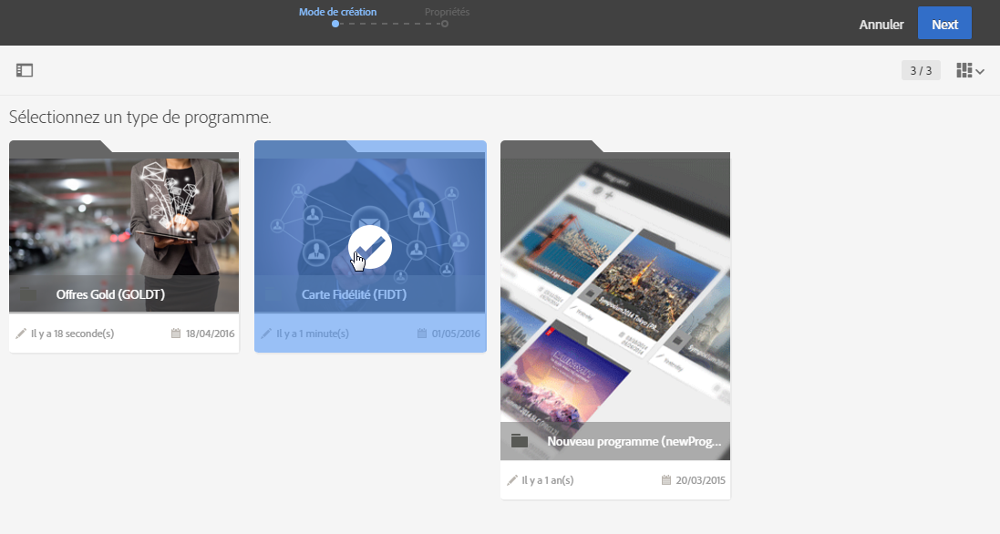
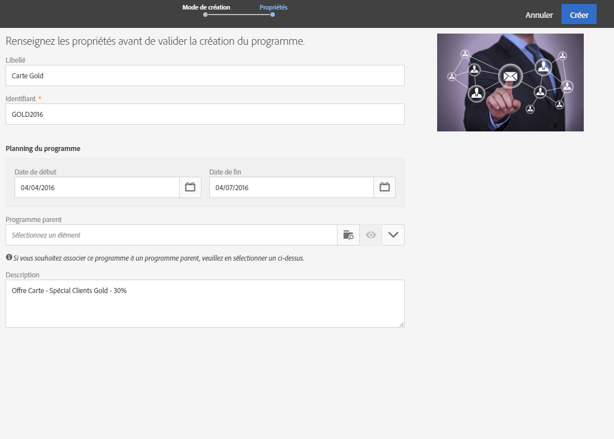
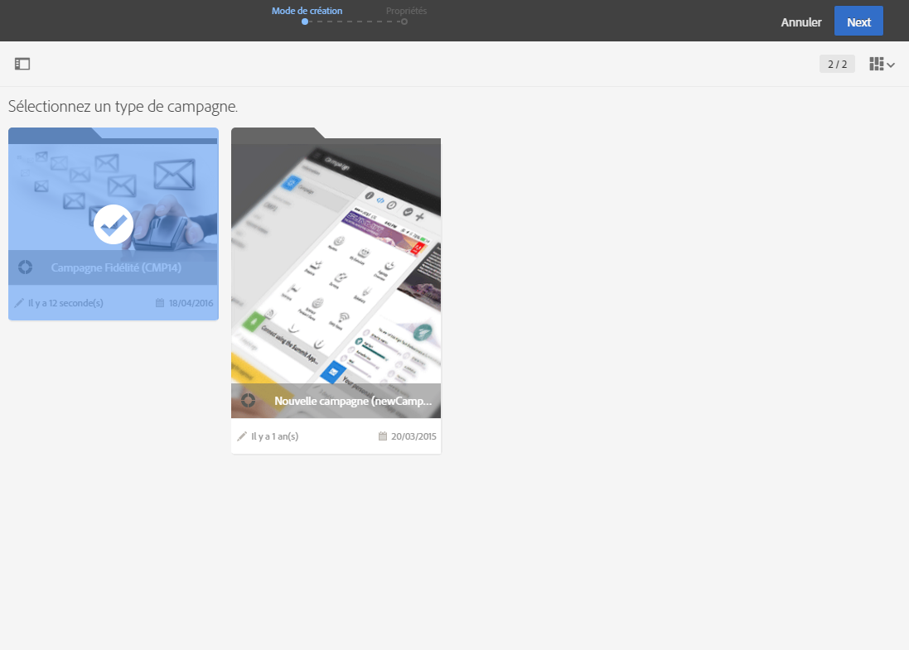
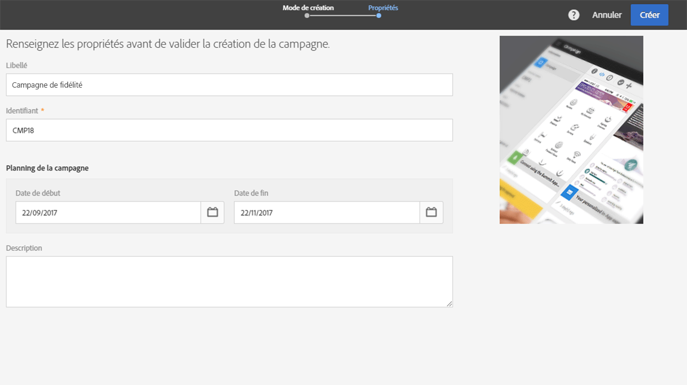
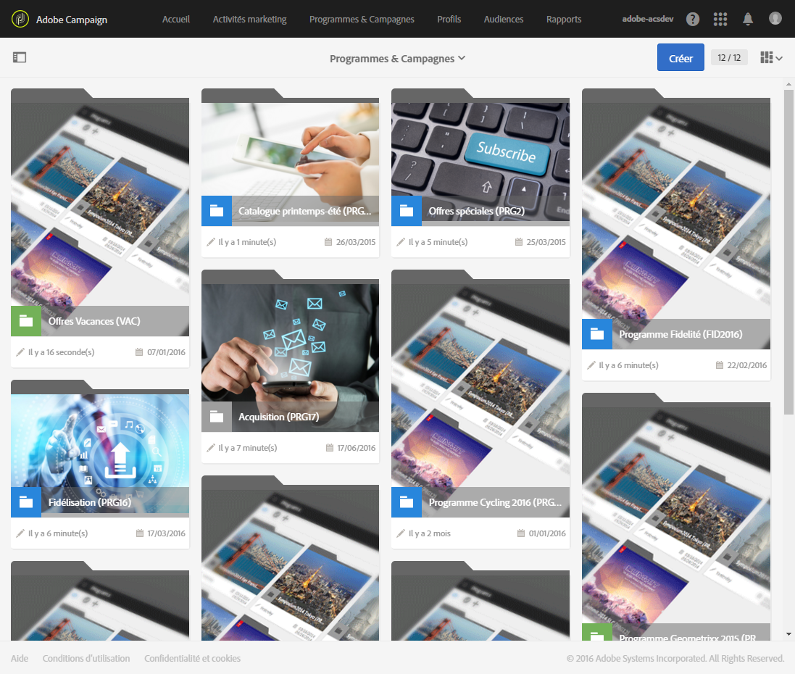

# Programmes et campagnes{#programs-and-campaigns}

## Plans, programmes et campagnes {#about-plans--programs-and-campaigns}

Adobe Campaign permet de concevoir des campagnes marketing dans lesquelles vous pouvez créer et gérer différents types d'activités : emails, SMS, notifications push, workflows, landing pages. Ces campagnes et leurs contenus peuvent être regroupés dans des programmes.

Les programmes et les campagnes permettent de regrouper et de visualiser les différentes activités marketing qui leur sont associées.

* Un **programme** peut contenir d'autres programmes, des campagnes, des workflows et des landing pages. Il apparaît dans le planning et permet d'organiser vos activités marketing : vous pouvez les classer par pays, marque, entité, etc.
* Une **campagne** permet de regrouper toutes les activités marketing de votre choix sous une seule entité. Une campagne peut contenir des emails, des SMS, des notifications push, des courriers, des workflows et des landing pages.

Pour mieux organiser vos plans marketing, Adobe recommande d'utiliser la hiérarchie suivante : Programme &gt; Sous-programmes &gt; Campagnes &gt; Workflows &gt; Diffusions.

Des rapports sur les programmes et les campagnes permettent d'analyser leur impact. Vous pouvez par exemple créer des rapports au niveau des campagnes pour agréger les données sur toutes les diffusions contenues dans une campagne donnée.

**Rubriques connexes :**

* [Planning](../../start/using/timeline.md)
* [Rapports dynamiques](../../reporting/using/about-dynamic-reports.md)

## Créer un programme {#creating-a-program}

Le programme correspond au premier niveau de l'organisation. Il peut contenir des sous-programmes, des campagnes, des workflows ou des landing pages.

1. Depuis la page d'accueil d'Adobe Campaign, sélectionnez la vignette **[!UICONTROL Programmes &amp; Campagnes].**
1. Cliquez sur le bouton **[!UICONTROL Créer].**
1. Dans l'écran **[!UICONTROL Mode de création], sélectionnez un type de programme.**

   

   The program types available are based on templates defined in the **[!UICONTROL Resources]** &gt; **[!UICONTROL Templates]** &gt; **[!UICONTROL Program templates]** section. Voir à ce propos la section [Gestion des modèles](../../start/using/about-templates.md).

1. Dans l'écran **[!UICONTROL Propriétés], saisissez le nom du programme et son identifiant.**

   

1. Sélectionnez une date de début et une date de fin pour le programme. Ces dates s'appliquent uniquement au programme.

   Vous pouvez choisir de créer votre programme à l'intérieur d'un programme parent. Sélectionnez alors celui-ci parmi les programmes existants.

1. Cliquez sur **[!UICONTROL Créer]pour valider la création du programme.**

Le programme est créé et affiché. Utilisez le bouton **[!UICONTROL Créer]pour ajouter des sous-programmes, des campagnes, des workflows ou des landing pages.**

>[!NOTE]
>
>Vous pouvez également créer un programme depuis la liste des activités marketing.

## Créer une campagne {#creating-a-campaign}

Dans les programmes et sous-programmes, vous pouvez ajouter des campagnes. Les campagnes peuvent contenir des activités marketing telles que des emails, des SMS, des notifications push, des workflows et des landing pages.

1. Depuis la page d'accueil d'Adobe Campaign, sélectionnez la vignette **[!UICONTROL Programmes &amp; Campagnes]et accédez à un programme ou sous-programme.**
1. Cliquez sur le bouton **[!UICONTROL Créer]** et sélectionnez **[!UICONTROL Campagne]**.
1. Dans l'écran **[!UICONTROL Mode de création], sélectionnez un type de campagne.**

   

   The campaign types available are based on templates defined in **[!UICONTROL Resources]** &gt; **[!UICONTROL Templates]** &gt; **[!UICONTROL Campaign templates]**. Voir à ce propos la section [Gestion des modèles](../../start/using/about-templates.md).

1. Dans l'écran **[!UICONTROL Propriétés], saisissez le nom de la campagne et son identifiant.**
1. Sélectionnez une date de début et une date de fin pour la campagne. Ces dates s'appliquent uniquement à la campagne.

   

1. Cliquez sur **[!UICONTROL Créer]pour valider la création de la campagne.**

La campagne est créée et affichée. Utilisez le bouton **[!UICONTROL Créer]pour ajouter des activités marketing à votre campagne.**

>[!NOTE]
>
>Selon votre contrat de licence, il est possible que vous n'ayez accès qu'à certaines de ces activités.

Vous pouvez également créer une campagne depuis la liste des activités marketing. Vous pouvez choisir d'associer l'activité marketing à un sous-programme ou programme parent via la fenêtre des propriétés de la campagne.

## Icônes et statuts des programmes et campagnes {#programs-and-campaigns-icons-and-statuses}

Chaque programme et chaque campagne de la liste sont représentés par un visuel et une icône dont la couleur indique le statut d'exécution. Ce statut dépend de la période de validité du programme ou de la campagne.

* Gris : le programme/la campagne n'a pas encore commencé - statut **[!UICONTROL En édition].**
* Bleu : le programme/la campagne est en cours - statut **[!UICONTROL En cours].**
* Vert : le programme/la campagne est terminé(e) - statut **[!UICONTROL Terminé.]** Par défaut, la date de début de validité est automatiquement renseignée avec la date du jour, et la date de fin est calculée par rapport à la date de début (**J+186 jours**). Vous pouvez modifier ces dates dans les propriétés du programme ou de la campagne.

