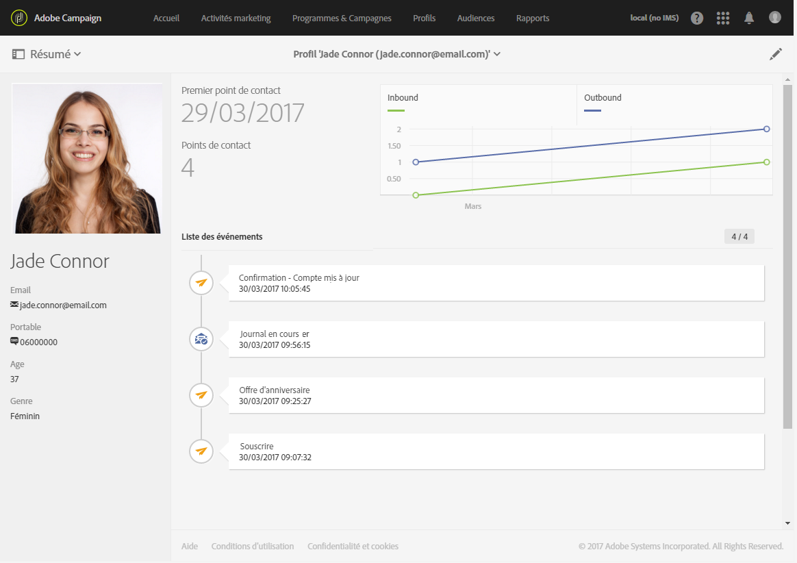

# Segmentation et ciblage{#segmentation-and-targeting}

## Profils {#profiles}

Utilisez le modèle de données flexible d'Adobe Campaign afin d'enrichir vos données de profils client et ajoutez des nouveaux attributs ou tables. Servez-vous ensuite de ces profils client pour accroître la précision de la segmentation, de la personnalisation et du reporting.

Les profils Adobe Campaign représentent l'ensemble des contacts stockés dans la base de données. Chaque profil correspond à une entrée dans la base de données qui contient les informations nécessaires pour faire l'objet de ciblage, qualification et tracking individuel. Ainsi, un profil peut être: un client, un prospect, un individu inscrit à une newsletter, un destinataire, un utilisateur, ou toute autre dénomination selon l'organisation.

La fonctionnalité des profils client intègre l'ensemble de vos données client en un même lieu :

Adobe Campaign propose différents mécanismes pour l'acquisition de profils : la collecte de données en ligne via [landing pages](../../channels/using/about-landing-pages.md), des [mécanismes d'import automatisé](../../automating/using/about-data-import-and-export.md) ou manuel, la [saisie directe](../../audiences/using/creating-profiles.md) dans l'interface Adobe Campaign, ainsi que la création en masse via les [API Campaign](https://docs.campaign.adobe.com/doc/standard/en/api/ACS_API.html).

**Rubriques connexes :**

* Découvrez les différents types de profils dans la section [Profils](../../audiences/using/about-profiles.md).
* Accédez au nombre de **Profils actifs** au sein de votre organisation dans [cette section](../../audiences/using/active-profiles.md).
* Découvrez comment personnaliser vos données et gérer des tâches de gestion des données complexes, telles que des calculs, des agrégats, des déduplications et des fusions à l'aide des [fonctionnalités de ciblage de workflow](../../automating/using/about-targeting-activities.md).

## Audiences {#audiences}

Pour vous permettre de diffuser des messages pertinents et performants, ainsi que d'atteindre vos clients efficacement, Adobe Campaign intègre des fonctionnalités de ciblage et d'analyse avancée. Grâce aux workflows et à l'éditeur de requêtes, vous pouvez créer des audiences qui seront ciblées par vos différentes campagnes, selon les informations dont vous disposez à leur sujet, leurs activités, leur langue, leurs préférences ou leur historique marketing. De cette façon, vous pouvez, par exemple, filtrer les profils abonnés ou créer des audiences de la cible en fonction d'un nombre illimité de critères.

Les audiences sont présentées [sur cette page](../../audiences/using/about-audiences.md) et décrites dans le détail dans la section [Audiences](../../audiences/using/creating-audiences.md).

**Rubriques connexes :**

* Découvrez comment atteindre des audiences multilingues à travers plusieurs régions en envoyant des [notifications push multilingues](../../channels/using/creating-a-multilingual-push-notification.md) ou des [emails multilingues](../../channels/using/creating-a-multilingual-email.md)
* Découvrez comment [créer des requêtes](../../audiences/using/creating-audiences.md#creating-query-audiences) pour créer des audiences
* Découvrez comment [créer des audiences de liste](../../audiences/using/creating-audiences.md#creating-list-audiences) dans un workflow
* Découvrez comment [importer une audience à partir d'un fichier](../../audiences/using/creating-audiences.md#creating-file-audiences) dans un workflow
* Découvrez comment [partager des audiences](../../audiences/using/creating-audiences.md#creating-experience-cloud-audiences) avec des solutions Experience Cloud

## Règlement général sur la protection des données {#general-data-protection-regulation}

Le RGPD est la nouvelle loi de l'Union européenne (UE) sur la protection de la vie privée. Il harmonise et modernise les exigences en matière de protection des données. Il s'applique aux clients Adobe Campaign qui détiennent des données pour des personnes concernées résidant dans l'UE. Outre les fonctionnalités de protection des données déjà disponibles dans Adobe Campaign (notamment la gestion des accords, les paramètres de rétention des données et les rôles utilisateur), nous incluons, dans le cadre de notre rôle de fournisseur de service de traitement des données, des fonctionnalités supplémentaires pour faciliter votre préparation en tant que Contrôleur de données à certaines demandes RGPD.

Pour plus d'informations sur les outils et fonctionnalités proposés par Adobe Campaign pour vous aider à être en conformité avec le RGPD, reportez-vous à ce [guide](https://docs.campaign.adobe.com/doc/standard/getting_started/en/ACS_GDPR.html).

## Gestion de la fatigue {#fatigue-management}

Les règles de fatigue permettent aux marketeurs de définir des règles métier cross-canal globales qui excluront automatiquement les profils sur-sollicités des campagnes.

Pour implémenter une règle de fatigue, vous devez définir un nombre maximum de messages par profil et sélectionner une période pendant laquelle s'appliquera la règle. Lors de la préparation de la diffusion, les profils sont exclus ou non de la diffusion, selon le nombre de messages qui leur ont déjà été adressés.

**Rubriques connexes :**

* Découvrez comment [concevoir des règles de fatigue](../../administration/using/fatigue-rules.md#examples) à travers un jeu d'échantillons
* Découvrez comment créer des [règles de typologie](../../administration/using/about-typology-rules.md)
* Utilisez des [règles de filtre](../../administration/using/filtering-rules.md) pour affiner l'audience de vos messages
