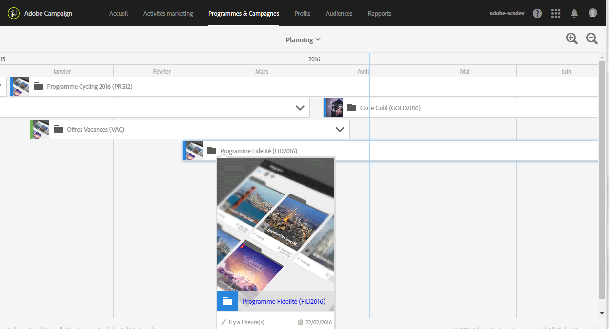
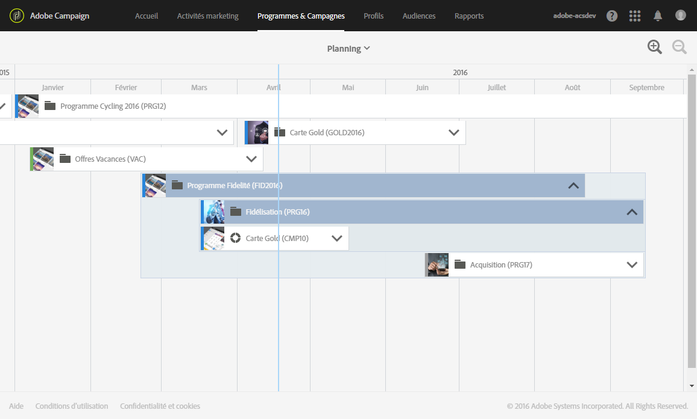
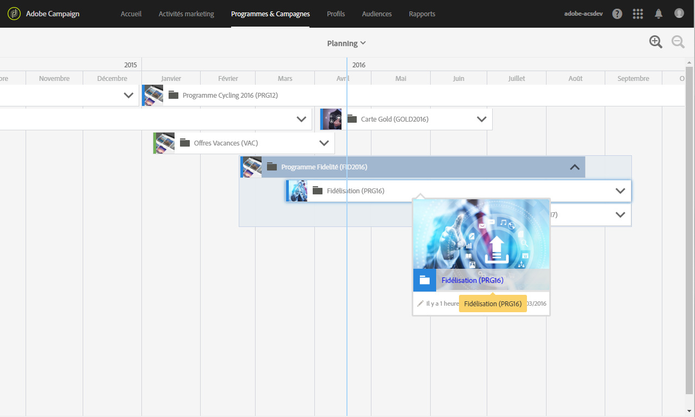

# Planning{#timeline}

Le **[!UICONTROL Planning]** permet de visualiser les programmes en cours ainsi que leur contenu.

Pour accéder au planning, cliquez sur la vignette correspondante depuis la page d'accueil.

Le planning présente par défaut uniquement les programmes, qui s'affichent chronologiquement entre les dates de début et de fin définies pour chacun d'entre eux.

Chaque programme est représenté par un cadre contenant la miniature et le libellé correspondants. Selon la largeur de l'écran et le nombre d'éléments à afficher, le libellé peut être remplacé par l'identifiant du programme.

La ligne verticale bleue est un repère chronologique correspondant à la date du jour, figurant par défaut au milieu de l'écran. Il est possible de faire défiler l'écran vers la droite ou la gauche pour modifier la période affichée.

Les boutons  et  permettent de restreindre ou d'élargir le périmètre. Le bouton  permet ainsi d'augmenter le niveau de détail sur une période plus restreinte, jusqu'à afficher les jours, tandis que le bouton  permet d'afficher une période plus large.

Cliquez sur la flèche située à droite du nom de chaque programme pour afficher son contenu. Un programme peut contenir des sous-programmes, des campagnes et des landing pages. Une campagne se déploie de la même façon qu'un programme et peut contenir des emails, des SMS et des landing pages.

>[!NOTE]
>
>Les workflows ne présentant pas de notion de date, ils ne figurent pas dans le planning.

Lorsque le contenu d'un programme ou d'une campagne est affiché, le cadre correspondant passe au bleu et la flèche située à droite change d'orientation. Cliquez à nouveau sur la flèche pour masquer le contenu.

Chaque élément est accompagné d'une icône correspondant à son type :

*  : programme
*  : Campaign
*  : landing page
*  : e-mail
*  : SMS
*  : notification push

La bande colorée sur le bord gauche de chaque cadre indique le statut de l'élément correspondant :

* Quand un élément n'a pas encore commencé, la bande est grise.
* Si un élément est en cours, la bande s'affiche en bleu.
* Dès qu'un élément est terminé, la bande passe au vert.

Cliquez sur un programme ou tout autre élément affiché pour faire apparaître la vignette correspondante. Cliquez alors sur la vignette pour accéder directement au contenu de l'élément sélectionné et le modifier.

Cliquez n'importe où ailleurs dans l'écran pour faire disparaître la vignette.
