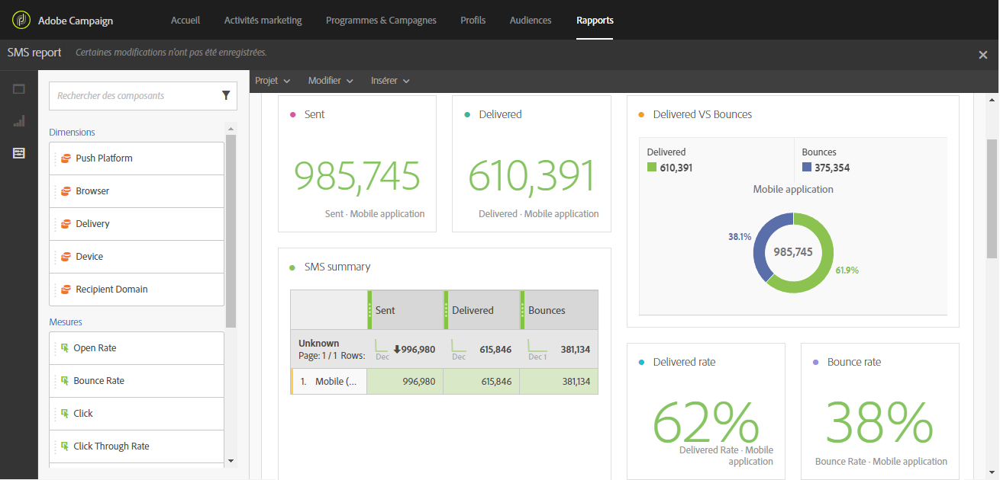

# Tracking, suivi et reporting{#tracking-monitoring-and-reporting}

Outre des modèles de reporting d'usine puissants, Adobe Campaign vous permet de créer des rapports personnalisés au niveau d'une diffusion, d'une campagne, d'un utilisateur ou d'un segment. Trackez vos messages et comprenez le comportement de vos clients en enrichissant progressivement leurs données de profil. Avec les outils de reporting et d'analyse, vous capitalisez à chaque nouvelle campagne, ciblez mieux vos actions marketing et optimisez leur impact et leur retour sur investissement.

L'interface graphique permet d'avoir rapidement et facilement accès aux principaux indicateurs et aux statistiques de la diffusion.

L'interface utilisateur de reporting de campagne facilite la création de rapports dynamiques. Vous pouvez utiliser des variables par glisser-déposer afin de personnaliser vos rapports et d'analyser la réussite de vos campagnes. En fonction de la complexité de vos requêtes et de vos calculs, les données peuvent être agrégées dans une vue de liste et sont accessibles dans un format qui facilite la génération de rapports d'analytique marketing.

Pour plus d'informations sur les rapports, consultez la section [Accéder aux rapports](../../reporting/using/about-dynamic-reports.md).

Avec Adobe Campaign, vous pouvez contrôler et tracker chaque diffusion. Le tableau de bord des messages affiche des logs dédiés pour suivre les processus et les règles, ainsi qu'identifier les erreurs et les avertissements possibles. Pour plus d'informations sur le contrôle des diffusions, consultez la section [Contrôler une diffusion](../../sending/using/monitoring-a-delivery.md). Les principes et les fonctionnalités de tracking sont présentés dans la section [Messages de tracking](../../sending/using/tracking-messages.md).
