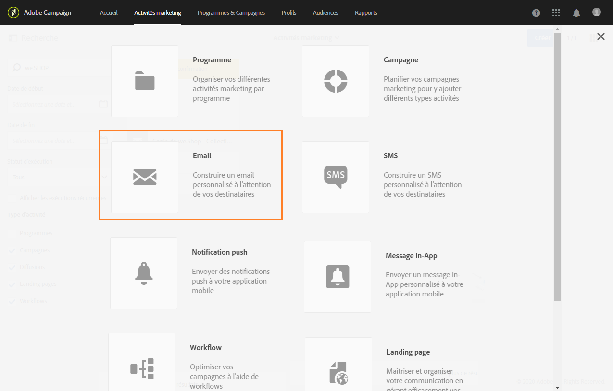
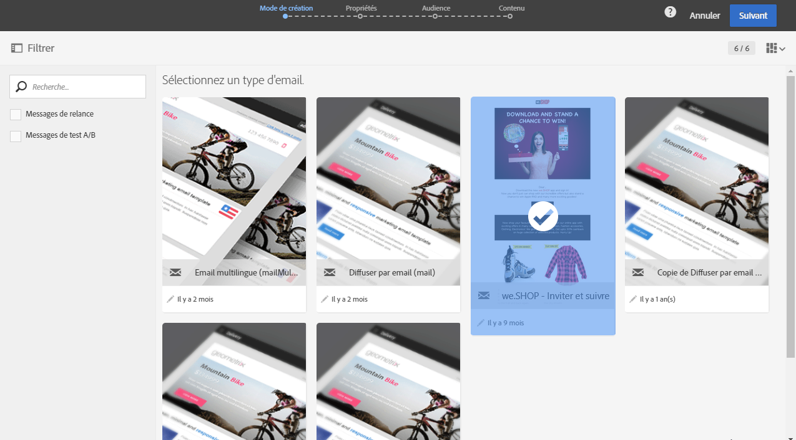
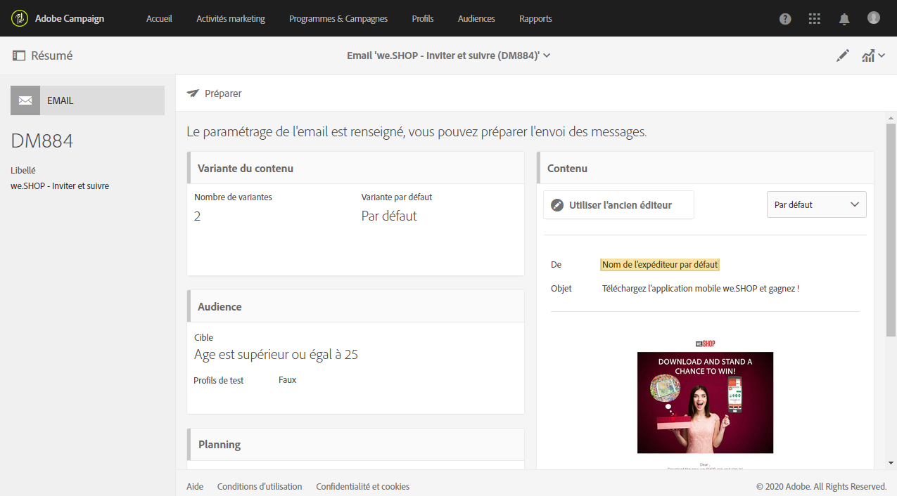

# Utiliser un modèle{#using-a-template}

Voyons à présent comment utiliser le modèle d'email créé dans la section précédente.

>[!NOTE]
>
>La création d'une activité marketing basée sur un modèle est en général réalisée par un profil de type utilisateur standard.

1. Créez une activité marketing.

   

1. Dans le premier écran de l'assistant, sélectionnez le modèle que vous souhaitez utiliser.

   

   L'activité marketing est pré-configurée avec les paramètres définis dans le modèle.

   

